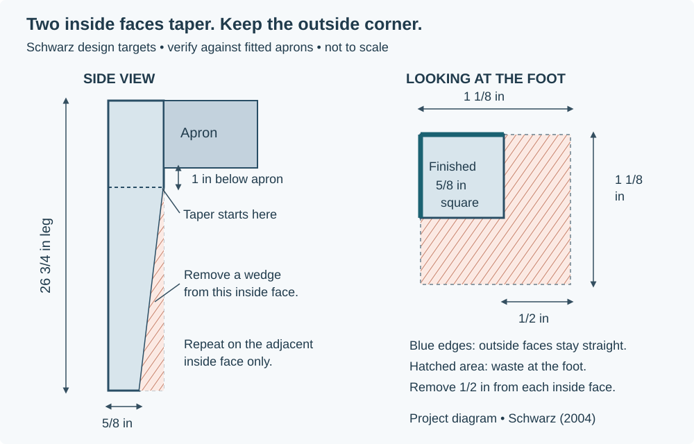
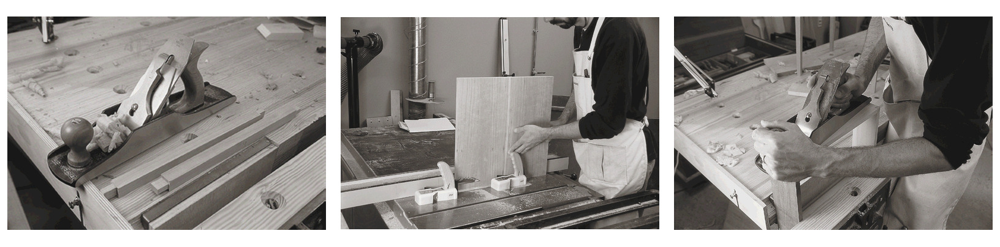
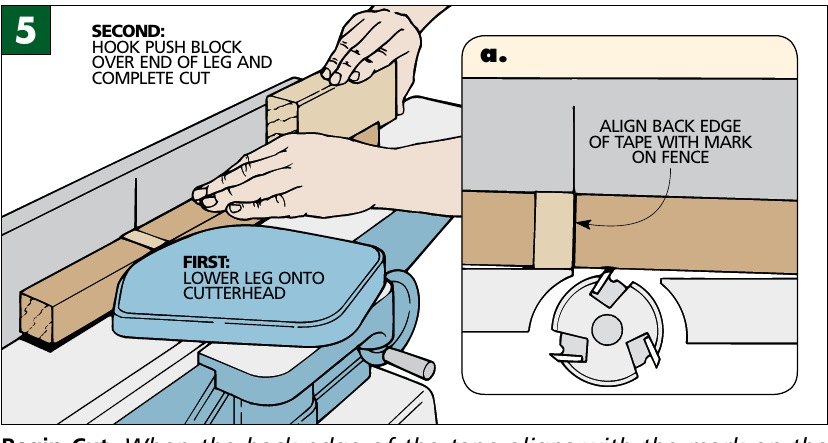

# Carl's Wisdom: Tapering the Legs

The Woodsmith PDF has two excellent illustrated machine references: a **table-saw tapering jig** and **tapering on a jointer**. Our original Schwarz article supplies the **saw near the line, then refine with a hand plane** approach. These are different methods, and the two tables also have different taper geometry.

**On this page**

- [Our taper dimensions](#our-taper-dimensions)
- [Sawing and hand-plane refinement](#sawing-and-hand-plane-refinement)
- [Woodsmith's tapering jig](#woodsmiths-tapering-jig)
- [The jointer diagrams and Carl's warning](#the-jointer-diagrams-and-carls-warning)
- [Class preparation and stopping point](#class-preparation-and-stopping-point)

## Our taper dimensions

| Feature | Our retained Schwarz baseline | What to check on the workpiece |
|---|---|---|
| Square leg before tapering | **1 1/8 x 1 1/8 x 26 3/4 in**, thickness x width x length | Actual square size, length, straightness, and joinery |
| Faces tapered | **Two adjacent inside faces only** | Label all four legs and identify both outside faces from the assembled orientation |
| Taper start | **1 in below the bottom of the apron** | Locate from the actual fitted apron; a 5-in apron flush at the leg top implies 6 in from the top |
| Finished foot | **5/8 x 5/8 in** cross-section | Measure both directions at the foot |
| Material removed at the foot | **1/2 in from each inside face** | Derived from 1 1/8 minus 5/8; the two outside faces stay intact |

*Project-created study diagram, based on Schwarz's [drawing, PDF p. 4](https://www.popularwoodworking.com/app/uploads/2010/10/HiRes-SEPT2004-Seg2.pdf#page=4), and taper discussion on PDF pp. 3–5. Not to scale.*

**Complete and check the leg joinery while the stock is square.** Compare all four legs' orientation and taper marks as a set before removing material.

## Sawing and hand-plane refinement

Schwarz describes sawing close to the layout with a bandsaw, or a jigsaw as an alternative, and refining the sawn surface:

> “with a hand plane (my tool of choice)”

— Christopher Schwarz, [Simple Shaker End Table, PDF p. 5 / printed p. 20](https://www.popularwoodworking.com/app/uploads/2010/10/HiRes-SEPT2004-Seg2.pdf#page=5).

This approach separates bulk waste removal from the careful final surface. Have Carl demonstrate how far to leave the saw cut outside the line and how to hold the slender leg for planing. Use a securely clamped support, vise, or suitable bench stops so the part cannot slide or rock. Pad the holding surfaces to protect the poplar. Support the work again after turning it for the second inside face; a previously tapered surface can no longer be assumed to sit flat.

On a practice piece, set the plane for light shavings, read the grain, and check frequently with a straightedge. Work toward one straight, flat taper without rounding its edges, hollowing the middle, or extending the taper into the joinery zone. Grain direction determines the planing direction; a diagram cannot tell you that for your actual leg. Keep the original reference faces identifiable until all four legs have been checked.

## Woodsmith's tapering jig

The Woodsmith jig rides in the table saw's miter slot and locates the leg on a platform. Its fences and hold-down make the setup repeatable. These two selected figures explain the useful ideas: align a taper line with the cut-reference edge, then hold the leg securely.

<figure>

<figcaption>Layout against the sled's cut-reference edge. Local Woodsmith PDF p. 12, printed p. 10, figure 6.</figcaption>
</figure>
<figure>

<figcaption>A positive hold-down, rather than a hand serving as the clamp. Same page, figure 8. Dimensions belong to that jig.</figcaption>
</figure>

The original jig is designed for **four-face tapers on 1 1/2-in-square legs**, taking 1/4 in from each face at the foot. Its central dowel and rotating sequence are tied to that geometry. Our two-face taper retains a different outside reference corner and removes 1/2 in from each inside face. **Do not copy the center-hole location, fence offsets, dimensions, or four-cut rotation sequence into our table.**

Carl must approve an adapted sled and demonstrate its use with test stock, positive clamping, the shop's guards and required blade clearance. Never make an unsupported freehand taper at the table saw. The selected figures are explanations of jig design, not a complete setup plan.

## The jointer diagrams and Carl's warning

**Instructor restriction:** Carl's red annotation on both final Woodsmith pages says this jointer-tapering technique is unsuitable for beginners because of safety concerns. Study it as a reference; do not attempt it independently. This warning applies to taper cutting on the jointer, not ordinary instructor-taught flattening and edge-jointing.

*Selected figure 5 from local Woodsmith PDF p. 14, printed p. 12, also carrying a printed magazine p. 32 marker. © 2007 August Home Publishing Co. Advanced reference only; Carl's restriction above is part of the context.*

The drawing shows why the method needs instruction: it starts a cut partway along a leg over a cutterhead, rather than feeding a square-ended board in the usual way. The full discussion connects reference marks, snipe, depth of cut, support against the fence, and a final cleanup pass. Its example arithmetic and four-face sequence belong to the hall table. A **thickness planer** is a different machine again; this page does not describe using one to cut our taper.

For the surrounding text and diagrams, see the local Woodsmith PDF **pp. 13–14**; for the tapering sled see **pp. 11–12**. The publisher's old PDF address currently returns 404. [Sources and Link Index](CARLS_WISDOM_SOURCES.md#the-two-project-pdfs) provides the bibliographic reference and current publisher issue page.

## Class preparation and stopping point

**Parts:** four poplar legs and comparable practice stock. **Tools and holding:** pencil, square, straightedge, rule or calipers, a sharp hand plane, padded vise or clamps and supports; a bandsaw/jigsaw or a properly designed taper sled only as demonstrated by Carl. Use the shop's eye, hearing, and dust protection for the operation.

Before cutting, verify actual leg sizes, paired joinery, inside/outside orientation, the apron-bottom position, start lines, and foot marks. Ask Carl to demonstrate the chosen method on a test piece and inspect its straightness and workholding.

**Stop after the practice piece and checked layout if the setup is unsettled.** Once approved tapers are complete, compare the four feet and taper starts, check each surface for flatness, and record actual dimensions. Complete the full base dry fit before glue-up; recheck square, twist, and apron setbacks.

Sources: Carl's email PDF p. 6 and his red annotations on Woodsmith PDF pp. 13–14; Woodsmith, <em>Shaker Hall Table</em>, © 2007 August Home Publishing Co., selected figures from PDF pp. 12 and 14; Christopher Schwarz, <em>Woodworking Magazine</em>, Autumn 2004, <a href="https://www.popularwoodworking.com/app/uploads/2010/10/HiRes-SEPT2004-Seg2.pdf#page=3">PDF pp. 3–5</a>. Source images retain their copyright; see <a href="{{ '/attribution.html' | relative_url }}">Attribution</a>.

