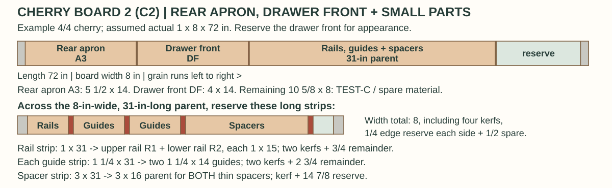
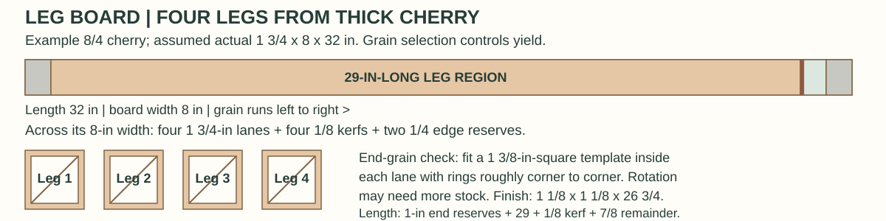
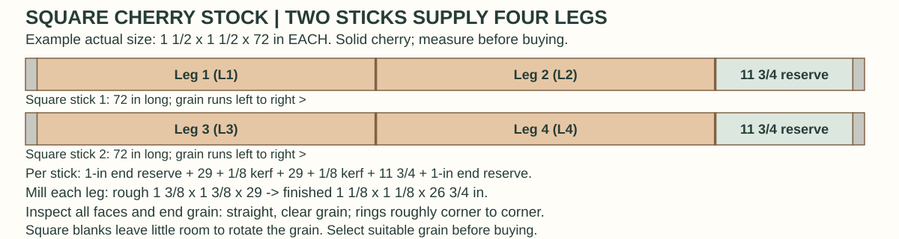
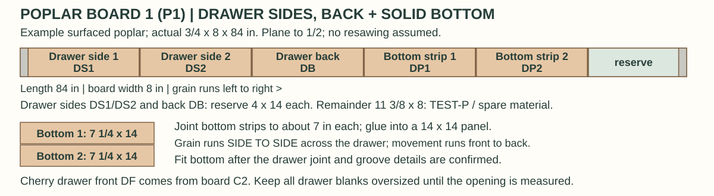

# Cutting diagram and lumber plan

**Start with the parts we must obtain, then lay them onto measured boards.** Reserve attractive wood for the top and drawer front, select the legs for grain, and use the remaining suitable stock for the smaller parts.

**Status: complete worked planning example, 2026-09-24.** Hand-cut dovetails are the current drawer choice. No actual board inventory or instructor-approved cutting layout is recorded yet. The rough sizes below are proposals; the illustrated stock sizes are hypothetical, not stock known to be available. Square-stock availability has not been checked with a supplier. Confirm the layout and machine work with the instructor before cutting.

This page separates [what to buy](#what-to-buy), [rough blanks](#rough-blanks-to-prepare), and [finished parts](#finished-parts-from-the-article). All three-dimensional sizes use **thickness x width x length, in inches**. Nominal `4/4` and `8/4` describe purchase categories only.

## Recommended approach

1. **Select leg stock separately.** Ask about suitable solid cherry square stock or individual leg blanks as well as the article's 8/4 board method. See the [square-stock alternative](#alternative-square-cherry-stock-for-the-legs). For the board method, find four straight-grained leg locations using the 1 3/8-in-square end-grain template. Reserve an optional fifth leg blank if the selected board permits it. Grain orientation can consume more width and thickness than a simple row of squares suggests.
2. **Reserve the top and drawer front before allocating aprons.** Try two or three wider, visually compatible top boards; let their appearance and usable widths determine the seams. The top example below uses three pieces. It is not a requirement to rip every top into equal strips.
3. **Plan the aprons, rails, and internal pieces next.** Keep the side aprons visually compatible. Sound but less attractive wood can supply guides and spacers. Do not count an offcut twice or assume an unidentified scrap will supply a required part.
4. **Reserve drawer material now; fit it later.** Keep the drawer front oversized and hold final drawer cuts until the dovetail and bottom details are confirmed, the base and guides are assembled, and the top is installed.
5. **Label practice stock as part of the layout.** Reserve matching-thickness material for joinery setups and cherry samples for finish trials before calling the remaining wood waste.

These priorities follow Schwarz's stock selection on [PDF pages 1-2](https://www.popularwoodworking.com/app/uploads/2010/10/HiRes-SEPT2004-Seg2.pdf#page=1), the panel companion on [pages 7-8](https://www.popularwoodworking.com/app/uploads/2010/10/HiRes-SEPT2004-Seg2.pdf#page=7), and the drawer sequence on [page 6](https://www.popularwoodworking.com/app/uploads/2010/10/HiRes-SEPT2004-Seg2.pdf#page=6).

## The table and its joinery

Two side aprons and one rear apron connect the legs; the front has two narrow rails around the drawer opening. Source drawing: Christopher Schwarz, *Woodworking Magazine*, Autumn 2004, [PDF page 4](https://www.popularwoodworking.com/app/uploads/2010/10/HiRes-SEPT2004-Seg2.pdf#page=4).

## What to buy

This is a **stock-selection brief**, not a fixed order by board feet. Board count and purchase lengths remain open until available boards pass the layout check.

| Stock group | Purchase category to inspect | Required yield and selection priorities |
|---|---|---|
| Leg stock | Suitable solid cherry square stock / individual leg blanks, **or** 8/4 cherry as in the article | Four clear, straight-grained leg blanks; an optional spare and separate setup material. Test the template against actual thickness, grain, and defects. |
| Top stock | 4/4 cherry that will finish flat at 3/4 in | Matching pieces for a panel at least 19 x 19 in **after edge jointing**, before final trimming to 18 x 18 in. Prefer compatible pieces from one board when possible. |
| Remaining cherry | 4/4 cherry that will finish flat at 3/4 in | Three aprons, two rails, four guides, one drawer front, spacer stock, and practice pieces. Reserve the drawer front for appearance before allocating these boards. |
| Drawer secondary wood | Poplar surfaced to a usable, flat 1/2 in, or thicker stock to plane to 1/2 in | Two sides, one back, and a solid bottom panel, plus test stock. A glued bottom panel avoids requiring a single very wide board. |

**Recommended drawer-stock approach:** buy flat stock at the required thickness when available, or plane suitable 4/4 poplar down to 1/2 in. Keep resawing optional until the instructor confirms the stock and equipment. A board actually 1 in thick cannot yield two finished 1/2-in layers: those layers alone use the entire thickness, leaving nothing for the resaw kerf or flattening. Even thicker stock needs a measured yield check.

No substitution of plywood, species, joints, or finished dimensions is assumed here. A different bottom or drawer joint would require revisiting the drawer front, sides, back, grooves, and bottom dimensions together.

**Which board is thicker?** C1 and C2 are ordinary 4/4 cherry for the parts that finish at 3/4 in. The legs require thicker material because they finish at 1 1/8 in square. Choose **solid cherry square stock or individual leg blanks**, or the **separate 8/4 cherry board** labeled LEG below. The wide board gives more freedom to orient the grain; square blanks must already have suitable grain within their available cross-section. "Secondary wood" means the poplar inside the drawer; it does not mean the second cherry board.

### How much wood?

The article says **about 12 board feet**. Treat that as its approximate project estimate, not a guaranteed purchase quantity or finished-volume calculation. Summing `quantity x thickness x width x length / 144` for its listed rectangular parts gives about **5.10 board feet**: 4.20 cherry and 0.90 poplar, before removing tapers, bevels, or joinery waste. Those rectangles cannot simply be packed into any 5.10 board feet of lumber.

First prove that the selected boards yield every rough blank, allowances, and practice pieces. Then total those boards using the supplier's tally rules. Add a specific spare board or blank if needed, with a stated purpose, rather than relying only on a blanket waste percentage.

## Rough blanks to prepare

**Proposed planning allowances, not article dimensions or instructions to cut today.** Dimension order is **thickness x width x length, in inches**; the columns separate those dimensions explicitly. Increase the allowances if checks, twist, snipe, grain selection, or the class's machine minimums require it.

"Keep stock thickness" means the actual purchased thickness is retained at rough breakdown; it does not mean a nominal 4/4 board measures exactly 1 in. Establish flat reference surfaces before final thicknessing. Keep small components in longer/wider parent stock while machining when required by the shop.

| ID | Qty. | Part or reserved blank | Rough thickness | Rough width | Rough length |
|---|---:|---|---|---:|---:|
| L1-L4 | 4 | Legs from square stock or grain-oriented board extraction | 1 3/8 | 1 3/8 | 29 |
| L5 | Optional 1 | Spare leg | 1 3/8 | 1 3/8 | 29 |
| T1-T3 | Example 3 | Top pieces | Keep stock thickness | 6 3/4 each | 21 each |
| A1-A3 | 3 | Side and rear aprons | Keep stock thickness | 5 1/2 | 14 |
| R1-R2 | 2 | Upper and lower front rails | Keep stock thickness | 1 | 15 |
| G1-G4 | 4 | Drawer guides | Keep stock thickness | 1 1/4 | 14 |
| SP | 1 | Parent stock for two thin spacers | Keep stock thickness | 3 | 16 |
| DF | 1 | Drawer front, held oversized | Keep stock thickness | 4 | 14 |
| DS1-DS2 | 2 | Drawer sides, held oversized | Keep stock thickness | 4 | 14 |
| DB | 1 | Drawer back, held oversized for dovetail layout | Keep stock thickness | 4 | 14 |
| DP1-DP2 | 2 strips | Drawer-bottom glue-up | Keep stock thickness | 7 1/4 each | 14 each |
| TEST | Separate reserve | Joinery and finish samples | Match the parts being tested | Shop-safe size | Shop-safe size |

For the top, three 6 3/4-in-wide rough pieces allow each to lose 1/4 in in total width during edge preparation and still form a 19 1/2-in-wide panel. They must also retain enough thickness to flatten the glued panel to 3/4 in. If they do not, change the board selection or layout before cutting.

For the bottom, two rough 7 1/4 x 14-in strips can each lose 1/4 in of width in edge preparation and form a 14 x 14-in panel. This enlarges the earlier rough envelope to show a complete glue-up with fitting room. Orient its grain **side to side across the drawer**, so seasonal movement is front to back. Confirm the groove, edge treatment, and back clearance with the instructor; do not glue a solid bottom rigidly into all its grooves.

The spacer entry reserves a manageable parent piece. It is not a direction to feed loose 3/16-in strips through a planer. Prepare thin strips with instructor-approved support or secure them for hand-planing.

## Complete example: four source boards, every required wooden part

These are **worked examples to discuss at the store and with the instructor**, not a fixed purchase order. The article estimates about 12 board feet; this deliberately roomy example contains about **15.94 board feet of actual board volume** before cutting. Dealer billing may use nominal thickness and different rounding. Ask whether available boards and usable offcuts can provide the same blanks with less excess. Do not sacrifice leg grain, thickness, or test stock merely to match the article estimate.

**Every example uses a 1/8-in separating saw kerf and a 1-in reserve at each board end.** End reserves include squaring cuts. Increase them for checks, snipe, or shop requirements. Broad-face layouts also need rip allowance, straightening loss, and sufficient thickness. A nominal 4/4 board is not guaranteed to measure 1 in or finish flat at 3/4 in.

| Example board | Assumed actual thickness x width x length (in) | Allocated parts | Reserved remainder |
|---|---|---|---|
| C1: 4/4 cherry | 1 x 8 x 96 | T1-T3 top, A1-A2 side aprons | 2 3/8 in of full width; other edge remnants uncounted |
| C2: 4/4 cherry | 1 x 8 x 72 | A3 rear apron; DF drawer front; R1-R2 rails; G1-G4 guides; SP1-SP2 spacers | 10 5/8 in of full width, assigned TEST-C / spare |
| LEG: 8/4 cherry | 1 3/4 x 8 x 32 | Four grain-selected legs L1-L4 | 7/8 in of full width; no spare leg assumed |
| P1: surfaced poplar | 3/4 x 8 x 84 | DS1-DS2 sides; DB back; DP1-DP2 bottom strips | 11 3/8 in of full width, assigned TEST-P / spare |

Example source-board labels C1, C2, LEG, and P1 are separate from part IDs. Give each real board its own label; all inventory entries below remain blank.

### What the part labels mean

The letters are short labels to write on the wood. The number distinguishes pieces of the same kind. Each diagram also spells out the part name.

| Label | Plain-language meaning |
|---|---|
| L1-L4 | Leg 1 through leg 4 |
| T1-T3 | Top strip 1 through top strip 3; glued into one tabletop |
| A1, A2, A3 | Side apron 1, side apron 2, and rear apron |
| R1, R2 | Upper front rail and lower front rail |
| G1-G4 | Four drawer guides: two lower running surfaces and two upper guides |
| SP1, SP2 | Spacer 1 and spacer 2 |
| DF | Drawer front |
| DS1, DS2 | Drawer side 1 and drawer side 2 |
| DB | Drawer back |
| DP1, DP2 | Drawer-bottom strip 1 and strip 2; glued into one bottom panel |
| TEST-C, TEST-P | Cherry and poplar reserved for practice/setup cuts |

The **source-board labels** are different: C1 and C2 mean cherry boards 1 and 2; LEG is the separate thick cherry board for the legs; P1 is poplar board 1.

### C1: tabletop and both side aprons

The earlier top-only diagram left 30 5/8 in unassigned. Here it supplies two 14-in apron sections, two additional 1/8-in kerfs, and a 2 3/8-in remainder. The full length check is `2 + (3 x 21) + (2 x 14) + (5 x 1/8) + 2 3/8 = 96`.

The top pieces use rough widths of 6 3/4 in within the 8-in board. The other 1 1/4 in covers the rip kerf, edge cleanup, and edge waste; it is not a guaranteed reusable strip. Apron sections similarly reserve a 5 1/2-in rough width within the 8-in board. A1 and A2 are the **left and right side aprons**; each finishes at 3/4 x 5 x 12 1/2 in, including its end tenons.

### C2: rear apron, drawer front, rails, guides, and spacers

The full length check is `2 + 14 + 14 + 31 + (3 x 1/8) + 10 5/8 = 72`. A3 is the **rear apron**. There is no front apron: the two narrow front rails frame the drawer opening. Reserve the attractive DF section before assigning the other parts.

Keep the 31-in parent intact while flattening and thicknessing when the shop requires it. Its width allocation is `1/4 + 1 + 1/8 + 1 1/4 + 1/8 + 1 1/4 + 1/8 + 3 + 1/8 + 1/2 + 1/4 = 8`. These are **rough reservation widths**. Confirm whether the saw, guards, push blocks, support, and shop minimum workpiece sizes allow the intended sequence. Have the instructor demonstrate the narrow rips and spacer preparation; supported hand-tool methods are an alternative.

The SP reservation supplies **both** final 3/16 x 3/4 x 11 3/4-in spacers. It is a 3 x 16-in parent held at stock thickness, not an instruction to put loose thin strips through a planer. The 10 5/8-in remainder is a material reserve, not necessarily long enough for a machine test: leave it attached, rearrange allocations, or select additional longer test stock to meet shop minimums.

### LEG: the four legs

The length check is `1 + 29 + 1/8 + 7/8 + 1 = 32`. The broad-face width check is `2 x 1/4 + 4 x 1 3/4 + 4 x 1/8 = 8`. Each proposed lane must actually contain a 1 3/8-in-square blank, with suitable grain and extraction allowance, along the full 29-in length.

**This yield depends on grain.** The diagram assumes the template fits within each lane and the measured thickness. If rotating it to align the growth rings makes it protrude, choose wider/thicker stock or a different layout. Four rectangles on a face do not prove four good legs. An optional fifth leg requires extra confirmed stock. Label outside faces; only the two inside faces are tapered after the joinery is fitted. Angled extraction and tapering require the instructor's setup and workholding.

### Alternative: square cherry stock for the legs

This replaces the wide **LEG** board in the worked example. Cherry boards C1 and C2 and poplar board P1 still supply all the other parts exactly as drawn above and below. This is a proposed purchase option; supplier availability, actual dimensions, drying condition, straightness, and grain must be checked before buying.

**Required yield:** four finished legs, each **1 1/8 x 1 1/8 x 26 3/4 in**, in thickness x width x length order. Our proposed rough reserve remains **1 3/8 x 1 3/8 x 29 in** per leg. The larger purchased square sizes below are examples, not a claim that a dealer stocks them. Already flat, square stock may need different allowances; confirm its usable size with the instructor.

| Choose one purchase form | Example actual thickness x width x length (in) | Yield and allowances |
|---|---|---|
| Two long solid cherry square sticks | 1 1/2 x 1 1/2 x 72 each | Each supplies two 29-in rough legs, two 1/8-in kerfs, two 1-in end reserves, and an 11 3/4-in remainder |
| Four individual solid cherry leg blanks | 1 1/2 x 1 1/2 x 36 each | Each supplies one 29-in rough leg, one 1/8-in kerf, two 1-in end reserves, and a 4 7/8-in remainder |

**Choose either the two sticks or the four blanks, not both.** Neither option needs the wide LEG board. Each has 2.25 board feet of actual square-stock volume in this example; with C1, C2, and P1, the complete square-stock example totals about **15.08 actual board feet**. Dealers may price squares by the piece or length and may tally nominal sizes. Compare the actual purchase price rather than assuming that lower volume means lower cost.

Inspect grain along all four faces and the full intended 29-in region. Prefer clear, straight grain, with growth rings running roughly corner to corner at the ends. A square cross-section alone does not guarantee suitable leg grain. At the example 1 1/2-in size, there is little room to rotate a 1 3/8-in rough blank to correct unsuitable grain; select different stock if necessary. Confirm whether the offered stock is solid rather than glued from smaller pieces, to preserve the article's solid-cherry baseline.

Mill the squares to the chosen rough reserve and then to **1 1/8 in square**, allowing for any movement or cleanup that the actual stock needs. The mortises, rail joints, overall leg length, inside-face tapers, finished table height and base dimensions retain the article baselines. This changes the source of the leg wood, not the design. Confirm supported workholding and machine minimums with the instructor. Keep square-stock practice material at a safe working length; leave reserves attached or obtain longer stock if required. An optional spare leg requires additional confirmed stock.

### P1: the dovetailed drawer and its bottom

The length check is `2 + (5 x 14) + (5 x 1/8) + 11 3/8 = 84`. The 4-in side/back reservations and 7 1/4-in bottom-strip reservations include width for later trimming. Keep each part's grain along its 14-in section. Turn the glued bottom panel so its grain spans the drawer from left to right.

**Hand-cut dovetails are selected as of 2026-09-24.** The drawer front is cherry from C2; its sides, back, and bottom are poplar from P1. The 3/4-in front and 1/2-in secondary-stock thicknesses remain planning targets based on the article. The drawer back rough width is now 4 in, increased from 3 1/2 in to preserve the instructor's choice of back height and bottom arrangement.

Before final drawer cuts, confirm front dovetail style, rear joints, socket depth, groove position, bottom-edge treatment, and how the bottom can move and pass the back. Measure the assembled opening after guides and top are installed: width at top and bottom, height at both sides and center, and usable depth. **Fit front, sides, back, and bottom to those measurements; do not transfer the rabbeted drawer's lengths to the dovetailed version.**

### Allocation completeness

All required wooden parts have a source: 4 legs, 1 top from 3 strips, 3 aprons, 2 rails, 4 guides, 2 spacers, 1 drawer front, 2 drawer sides, 1 back, and 1 bottom from 2 strips. TEST-C and TEST-P are dedicated reserves, subject to shop-safe dimensions; no offcut is counted twice. A purchased cherry knob (article baseline about 7/8-in diameter, 3/8-in mounting tenon), #8 x 1-in top screws, and an optional scrap drawer stop are separate items to confirm.

These illustrations show **material allocations**, not an approved sequence of saw operations. Actual boards, defects, grain, blade kerfs, milling loss, and shop minimums determine the final layout.

## Finished parts from the article

Dimensions are **thickness x width x length, in inches**, checked against the cut list on [PDF page 3](https://www.popularwoodworking.com/app/uploads/2010/10/HiRes-SEPT2004-Seg2.pdf#page=3) and the [dimensioned drawing](images/dimensioned-plan.png). These remain article baselines until verified against the workpieces. The [project guide](PROJECT_BASE.md#article-cut-list) contains the associated construction notes.

**Our dovetailed drawer must be fitted to the opening. The four drawer rows below document the source's rabbeted option only.**

| IDs | Qty. | Part | Finished size | Wood |
|---|---:|---|---|---|
| L1-L4 | 4 | Legs, before tapering | 1 1/8 x 1 1/8 x 26 3/4 | Cherry |
| T1-T3 combined | 1 | Top | 3/4 x 18 x 18 | Cherry |
| A1-A3 | 3 | Aprons | 3/4 x 5 x 12 1/2 | Cherry |
| R1-R2 | 2 | Front rails | 3/4 x 3/4 x 13 1/4 | Cherry |
| G1-G4 | 4 | Drawer guides | 3/4 x 1 x 12 1/8 | Cherry |
| SP1-SP2 | 2 | Spacers | 3/16 x 3/4 x 11 3/4 | Cherry |
| DF | 1 | Drawer front | 3/4 x 3 1/2 x 11 3/4 | Cherry |
| DS1-DS2 | 2 | Drawer sides | 1/2 x 3 1/2 x 12 1/4 | Poplar |
| DB | 1 | Drawer back | 1/2 x 3 x 11 3/4 | Poplar |
| DP | 1 | Drawer bottom | 1/2 x 11 1/4 x 12 3/8 | Poplar |

**Joint lengths are already included.** The 12 1/2-in apron has two 3/8-in tenons, leaving 11 3/4 in between shoulders. The 13 1/4-in rail has two 3/4-in end joints, also leaving 11 3/4 in between shoulders. Do not add another pair of tenons to either listed length. Fit tenon thickness to the actual mortises, and confirm shoulder positions against the dry-fitted base.

**The four drawer rows above are archival rabbeted-drawer references, not cutting targets for our selected dovetailed drawer.** The 1/2-in bottom has rabbeted edges that fit the 1/4 x 1/4-in grooves; its whole thickness does not fit inside a 1/4-in groove. The narrower back permits the bottom to slide beneath it in the illustrated construction. Confirm these details on [PDF pages 10-11](https://www.popularwoodworking.com/app/uploads/2010/10/HiRes-SEPT2004-Seg2.pdf#page=10). Our selected hand-cut dovetails require a revised drawer layout fitted to the actual opening before final sizing.

## Actual board inventory and allocation

Give **every physical board its own ID**; add rows for additional boards. Measure thickness at several points and record the narrowest usable width. Mark defects on both faces and edges, measuring their positions from one labeled end. Store future board photographs in `progress/` at the workspace root and write the photo reference alongside the board ID.

Dimensions in this inventory are **actual thickness x width x length, in inches**. Do not enter a nominal label in place of a measurement.

| Board ID | Species / purchase category | Actual T x W x L | End loss, edge loss, and defects with locations | Grain, color, and preferred face | Assigned part IDs / photo reference |
|---|---|---|---|---|---|
|  |  |  |  |  |  |
|  |  |  |  |  |  |
|  |  |  |  |  |  |
|  |  |  |  |  |  |

Also record the actual rip, crosscut, and any resaw kerfs; edge-jointing allowance; surfacing allowance; shop minimum workpiece sizes; and which stock is reserved for tests. Different blades may remove different amounts.

For each board, the final diagram should show the board ID, measured outline, grain arrow, defects, rough-blank IDs and dimensions, every kerf, and remaining stock. Check length, width, **and thickness**; a layout that fits on the broad face may still fail after flattening or leg-grain selection. Do not rotate a long-grain part across the board's grain just to make it fit.

## First stock-layout session

**Bring:** tape or rule, calipers, square, straightedge, pencil/chalk, labels, and a 1 3/8-in-square cardboard leg template. Use the shop's moisture-checking method and acclimation guidance. For later milling, confirm the available jointer/planer or hand planes, supported breakdown saw setup, push blocks, clamps, and sleds or carriers with the instructor.

1. Inventory the boards and mark unusable regions before drawing any part outlines.
2. Mark the four leg locations and their intended outside faces. Check that the template fits at the chosen angle through usable stock along the full proposed 29-in rough length.
3. Arrange and label the top pieces, reserve the drawer front, and map the remaining rough blanks and test stock.
4. Check every reservation with the instructor, including machine minimums. Long/wide parent pieces may need to remain intact until small rails, guides, and spacers are ready to separate. Angled leg extraction, narrow rips, resawing, and taper setups need instructor demonstration or approval with suitable workholding.
5. After milling, record actual thicknesses and leg sizes in the [measurement record](PROJECT_BASE.md#measurement-record). Before any assembly glue-up, complete a dry fit and check square, twist, reveals, and drawer clearance as applicable. Dry-clamp the top too, checking its seams and flatness.

**Stopping point:** a labeled, measured board layout with the top, drawer front, legs, and test stock reserved. If rough milling is completed in the same class, leave later-dependent parts oversized. Hand-cut dovetails are selected; do not finalize their layout, bottom detail, or drawer dimensions until confirmed with the instructor and measured from the assembled opening; measure opening width at top and bottom, height at both sides and center, and usable depth after the guides and top are installed.

## Source and decisions

Based on Christopher Schwarz, "Simple Shaker End Table," *Woodworking Magazine*, Autumn 2004, printed pages 16-21, and David Thiel's companion articles on panels and rabbeted drawers. [Original publisher PDF](https://www.popularwoodworking.com/app/uploads/2010/10/HiRes-SEPT2004-Seg2.pdf). The complete layouts, square-stock alternative, and rough allowances are project planning aids, not illustrations or dimensions claimed to come from the article. See [attribution](ATTRIBUTION.md) and [current decisions](PROJECT_BASE.md#current-decisions).
