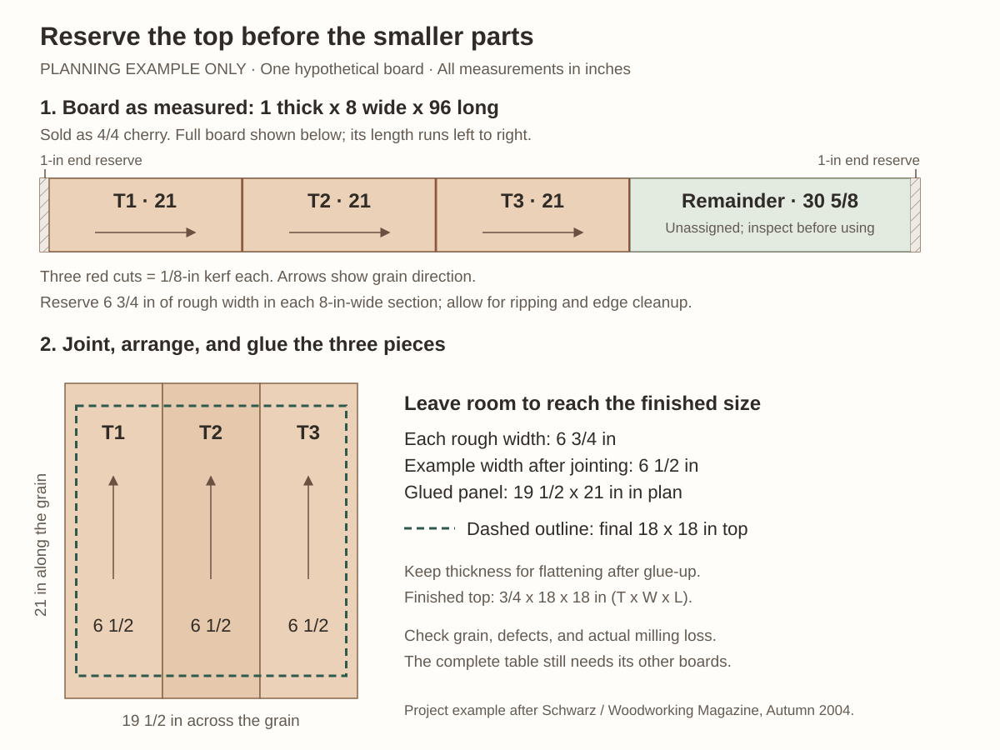

# Cutting diagram and lumber plan

**Start with the parts we must obtain, then lay them onto measured boards.** Reserve attractive wood for the top and drawer front, select the legs for grain, and use the remaining suitable stock for the smaller parts.

**Status: planning draft, 2026-09-23.** No actual board inventory or newer class directions are recorded in the project notes. The rough sizes below are proposals; the illustrated board is an example, not stock known to be available. Confirm the layout and machine work with the instructor before cutting.

This page separates [what to buy](#what-to-buy), [rough blanks](#rough-blanks-to-prepare), and [finished parts](#finished-parts-from-the-article). All three-dimensional sizes use **thickness x width x length, in inches**. Nominal `4/4` and `8/4` describe purchase categories only.

## Recommended approach

1. **Select leg stock separately.** Start with the article's 8/4 cherry and find four straight-grained leg locations using its 1 3/8-in-square end-grain template. Reserve an optional fifth leg blank if the selected board permits it. Grain orientation can consume more width and thickness than a simple row of squares suggests.
2. **Reserve the top and drawer front before allocating aprons.** Try two or three wider, visually compatible top boards; let their appearance and usable widths determine the seams. The example below uses three pieces. It is not a requirement to rip every top into equal strips.
3. **Plan the aprons, rails, and internal pieces next.** Keep the side aprons visually compatible. Sound but less attractive wood can supply guides and spacers. Do not count an offcut twice or assume an unidentified scrap will supply a required part.
4. **Reserve drawer material now; fit it later.** Keep the drawer front oversized and hold final drawer cuts until the joinery is chosen, the base and guides are assembled, and the top is installed.
5. **Label practice stock as part of the layout.** Reserve matching-thickness material for joinery setups and cherry samples for finish trials before calling the remaining wood waste.

These priorities follow Schwarz's stock selection on [PDF pages 1-2](https://www.popularwoodworking.com/app/uploads/2010/10/HiRes-SEPT2004-Seg2.pdf#page=1), the panel companion on [pages 7-8](https://www.popularwoodworking.com/app/uploads/2010/10/HiRes-SEPT2004-Seg2.pdf#page=7), and the drawer sequence on [page 6](https://www.popularwoodworking.com/app/uploads/2010/10/HiRes-SEPT2004-Seg2.pdf#page=6).

## What to buy

This is a **stock-selection brief**, not a fixed order by board feet. Board count and purchase lengths remain open until available boards pass the layout check.

| Stock group | Purchase category to inspect | Required yield and selection priorities |
|---|---|---|
| Leg stock | 8/4 cherry, as in the article | Four clear, straight-grained leg blanks; an optional spare and separate setup material. Test the template against actual thickness, grain, and defects. |
| Top stock | 4/4 cherry that will finish flat at 3/4 in | Matching pieces for a panel at least 19 x 19 in **after edge jointing**, before final trimming to 18 x 18 in. Prefer compatible pieces from one board when possible. |
| Remaining cherry | 4/4 cherry that will finish flat at 3/4 in | Three aprons, two rails, four guides, one drawer front, spacer stock, and practice pieces. Reserve the drawer front for appearance before allocating these boards. |
| Drawer secondary wood | Poplar surfaced to a usable, flat 1/2 in, or thicker stock to plane to 1/2 in | Two sides, one back, and a solid bottom panel, plus test stock. A glued bottom panel avoids requiring a single very wide board. |

**Recommended drawer-stock approach:** buy flat stock at the required thickness when available, or plane suitable 4/4 poplar down to 1/2 in. Keep resawing optional until the instructor confirms the stock and equipment. A board actually 1 in thick cannot yield two finished 1/2-in layers: those layers alone use the entire thickness, leaving nothing for the resaw kerf or flattening. Even thicker stock needs a measured yield check.

No substitution of plywood, species, joints, or finished dimensions is assumed here. A different bottom or drawer joint would require revisiting the drawer front, sides, back, grooves, and bottom dimensions together.

### How much wood?

The article says **about 12 board feet**. Treat that as its approximate project estimate, not a guaranteed purchase quantity or finished-volume calculation. Summing `quantity x thickness x width x length / 144` for its listed rectangular parts gives about **5.10 board feet**: 4.20 cherry and 0.90 poplar, before removing tapers, bevels, or joinery waste. Those rectangles cannot simply be packed into any 5.10 board feet of lumber.

First prove that the selected boards yield every rough blank, allowances, and practice pieces. Then total those boards using the supplier's tally rules. Add a specific spare board or blank if needed, with a stated purpose, rather than relying only on a blanket waste percentage.

## Rough blanks to prepare

**Proposed planning allowances, not article dimensions or instructions to cut today.** Dimension order is **thickness x width x length, in inches**; the columns separate those dimensions explicitly. Increase the allowances if checks, twist, snipe, grain selection, or the class's machine minimums require it.

"Keep stock thickness" means the actual purchased thickness is retained at rough breakdown; it does not mean a nominal 4/4 board measures exactly 1 in. Establish flat reference surfaces before final thicknessing. Keep small components in longer/wider parent stock while machining when required by the shop.

| ID | Qty. | Part or reserved blank | Rough thickness | Rough width | Rough length |
|---|---:|---|---|---:|---:|
| L1-L4 | 4 | Legs after grain-oriented extraction | 1 3/8 | 1 3/8 | 29 |
| L5 | Optional 1 | Spare leg | 1 3/8 | 1 3/8 | 29 |
| T1-T3 | Example 3 | Top pieces | Keep stock thickness | 6 3/4 each | 21 each |
| A1-A3 | 3 | Side and rear aprons | Keep stock thickness | 5 1/2 | 14 |
| R1-R2 | 2 | Upper and lower front rails | Keep stock thickness | 1 | 15 |
| G1-G4 | 4 | Drawer guides | Keep stock thickness | 1 1/4 | 14 |
| SP | 1 | Parent stock for two thin spacers | Keep stock thickness | 3 | 16 |
| DF | 1 | Drawer front, held oversized | Keep stock thickness | 4 | 14 |
| DS1-DS2 | 2 | Drawer sides, held oversized | Keep stock thickness | 4 | 14 |
| DB | 1 | Drawer back, held oversized | Keep stock thickness | 3 1/2 | 14 |
| DP | 1 panel | Drawer bottom, before fitting | Keep stock thickness | 12 1/2 | 14 |
| TEST | Separate reserve | Joinery and finish samples | Match the parts being tested | Shop-safe size | Shop-safe size |

For the top, three 6 3/4-in-wide rough pieces allow each to lose 1/4 in in total width during edge preparation and still form a 19 1/2-in-wide panel. They must also retain enough thickness to flatten the glued panel to 3/4 in. If they do not, change the board selection or layout before cutting.

For the bottom, the table reserves a panel envelope. Its individual boards, grain direction, and jointing allowance must be laid out separately once the drawer detail is settled. The solid bottom must be able to move across its grain; follow the chosen drawer construction rather than gluing it rigidly into its grooves.

The spacer entry reserves a manageable parent piece. It is not a direction to feed loose 3/16-in strips through a planer. Prepare thin strips with instructor-approved support or secure them for hand-planing.

## Example cutting diagram: reserve the top first

This example shows **only the top reservation on one hypothetical board**. It does not claim to supply the complete table. The other cherry, leg, poplar, and practice-stock allocations still need their own measured-board layouts.

[Open the diagram at full size](images/top-cutting-example.svg).

Assumptions for this example:

- **Purchase:** one 4/4 cherry board; **assumed actual size:** 1 x 8 x 96 in.
- Reserve 1 in at each end, including any squaring cut within that end allowance. Real checks may need much more removal.
- Reserve three 21-in-long sections and three separating crosscut kerfs of 1/8 in each. The full-width remainder is `96 - 2 - (3 x 21) - (3 x 1/8) = 30 5/8 in` long.
- Within each section, reserve a 6 3/4-in rough width. The remaining 1 1/4 in of the original 8-in width must cover the rip kerf, edge cleanup, and any edge waste; it is **not** a guaranteed reusable strip.
- Edge-joint to approximately 6 1/2 in per piece only if grain and stock permit. The resulting panel is approximately 19 1/2 x 21 in in plan, before trimming to 18 x 18 in.
- Keep the 30 5/8-in remainder unassigned until it is inspected. It may supply smaller parts or practice stock, but it has not yet been counted toward either.

The diagram records material reservations, not the order of saw operations. The instructor should determine safe breakdown and milling order for the actual board, available support, and machine limits.

## Finished parts from the article

Dimensions are **thickness x width x length, in inches**, checked against the cut list on [PDF page 3](https://www.popularwoodworking.com/app/uploads/2010/10/HiRes-SEPT2004-Seg2.pdf#page=3) and the [dimensioned drawing](images/dimensioned-plan.png). These remain article baselines until verified against the workpieces. The [project guide](PROJECT_BASE.md#article-cut-list) contains the associated construction notes.

| IDs | Qty. | Part | Finished size | Wood |
|---|---:|---|---|---|
| L1-L4 | 4 | Legs, before tapering | 1 1/8 x 1 1/8 x 26 3/4 | Cherry |
| T1-T3 combined | 1 | Top | 3/4 x 18 x 18 | Cherry |
| A1-A3 | 3 | Aprons | 3/4 x 5 x 12 1/2 | Cherry |
| R1-R2 | 2 | Front rails | 3/4 x 3/4 x 13 1/4 | Cherry |
| G1-G4 | 4 | Drawer guides | 3/4 x 1 x 12 1/8 | Cherry |
| SP1-SP2 | 2 | Spacers | 3/16 x 3/4 x 11 3/4 | Cherry |
| DF | 1 | Drawer front | 3/4 x 3 1/2 x 11 3/4 | Cherry |
| DS1-DS2 | 2 | Drawer sides | 1/2 x 3 1/2 x 12 1/4 | Poplar |
| DB | 1 | Drawer back | 1/2 x 3 x 11 3/4 | Poplar |
| DP | 1 | Drawer bottom | 1/2 x 11 1/4 x 12 3/8 | Poplar |

**Joint lengths are already included.** The 12 1/2-in apron has two 3/8-in tenons, leaving 11 3/4 in between shoulders. The 13 1/4-in rail has two 3/4-in end joints, also leaving 11 3/4 in between shoulders. Do not add another pair of tenons to either listed length. Fit tenon thickness to the actual mortises, and confirm shoulder positions against the dry-fitted base.

**The drawer list assumes rabbets.** The 1/2-in bottom has rabbeted edges that fit the 1/4 x 1/4-in grooves; its whole thickness does not fit inside a 1/4-in groove. The narrower back permits the bottom to slide beneath it in the illustrated construction. Confirm these details on [PDF pages 10-11](https://www.popularwoodworking.com/app/uploads/2010/10/HiRes-SEPT2004-Seg2.pdf#page=10). Hand-cut dovetails would require a revised drawer layout before final sizing.

## Actual board inventory and allocation

Give **every physical board its own ID**; add rows for additional boards. Measure thickness at several points and record the narrowest usable width. Mark defects on both faces and edges, measuring their positions from one labeled end. Store future board photographs in `progress/` at the workspace root and write the photo reference alongside the board ID.

Dimensions in this inventory are **actual thickness x width x length, in inches**. Do not enter a nominal label in place of a measurement.

| Board ID | Species / purchase category | Actual T x W x L | End loss, edge loss, and defects with locations | Grain, color, and preferred face | Assigned part IDs / photo reference |
|---|---|---|---|---|---|
| C-01 | Cherry / to record | To measure | To mark | To inspect | Unassigned |
| C-02 | Cherry / to record | To measure | To mark | To inspect | Unassigned |
| L-01 | Cherry / to record | To measure | To mark | End-grain template check | Unassigned |
| P-01 | Poplar / to record | To measure | To mark | To inspect | Unassigned |

Also record the actual rip, crosscut, and any resaw kerfs; edge-jointing allowance; surfacing allowance; shop minimum workpiece sizes; and which stock is reserved for tests. Different blades may remove different amounts.

For each board, the final diagram should show the board ID, measured outline, grain arrow, defects, rough-blank IDs and dimensions, every kerf, and remaining stock. Check length, width, **and thickness**; a layout that fits on the broad face may still fail after flattening or leg-grain selection. Do not rotate a long-grain part across the board's grain just to make it fit.

## First stock-layout session

**Bring:** tape or rule, calipers, square, straightedge, pencil/chalk, labels, and a 1 3/8-in-square cardboard leg template. Use the shop's moisture-checking method and acclimation guidance. For later milling, confirm the available jointer/planer or hand planes, supported breakdown saw setup, push blocks, clamps, and sleds or carriers with the instructor.

1. Inventory the boards and mark unusable regions before drawing any part outlines.
2. Mark the four leg locations and their intended outside faces. Check that the template fits at the chosen angle through usable stock along the full proposed 29-in rough length.
3. Arrange and label the top pieces, reserve the drawer front, and map the remaining rough blanks and test stock.
4. Check every reservation with the instructor, including machine minimums. Long/wide parent pieces may need to remain intact until small rails, guides, and spacers are ready to separate. Angled leg extraction, narrow rips, resawing, and taper setups need instructor demonstration or approval with suitable workholding.
5. After milling, record actual thicknesses and leg sizes in the [measurement record](PROJECT_BASE.md#measurement-record). Before any assembly glue-up, complete a dry fit and check square, twist, reveals, and drawer clearance as applicable. Dry-clamp the top too, checking its seams and flatness.

**Stopping point:** a labeled, measured board layout with the top, drawer front, legs, and test stock reserved. If rough milling is completed in the same class, leave later-dependent parts oversized. Do not finalize drawer joinery or dimensions until the instructor's choice and the assembled opening are known; measure opening width at top and bottom, height at both sides and center, and usable depth after the guides and top are installed.

## Source and decisions

Based on Christopher Schwarz, "Simple Shaker End Table," *Woodworking Magazine*, Autumn 2004, printed pages 16-21, and David Thiel's companion articles on panels and rabbeted drawers. [Original publisher PDF](https://www.popularwoodworking.com/app/uploads/2010/10/HiRes-SEPT2004-Seg2.pdf). The new diagram and rough allowances are project planning aids, not illustrations or dimensions claimed to come from the article. See [attribution](ATTRIBUTION.md) and [current decisions](PROJECT_BASE.md#current-decisions).
