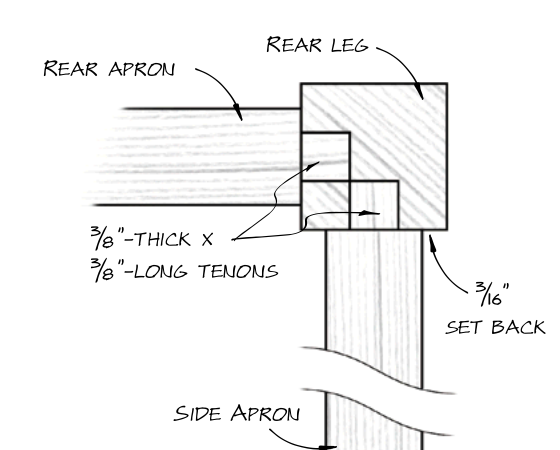
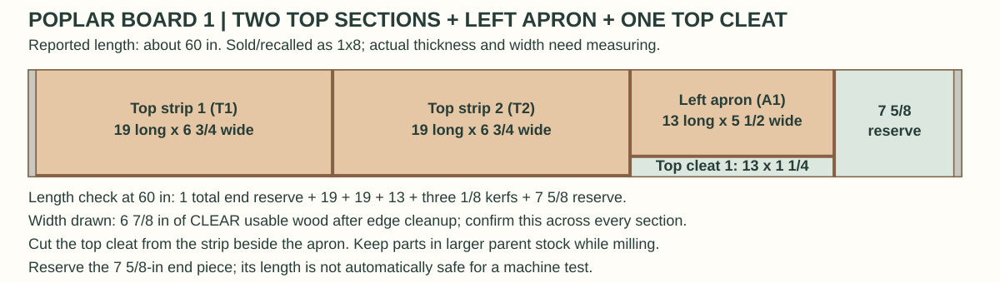
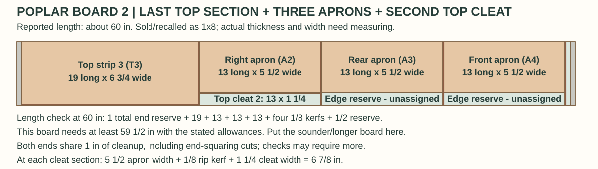
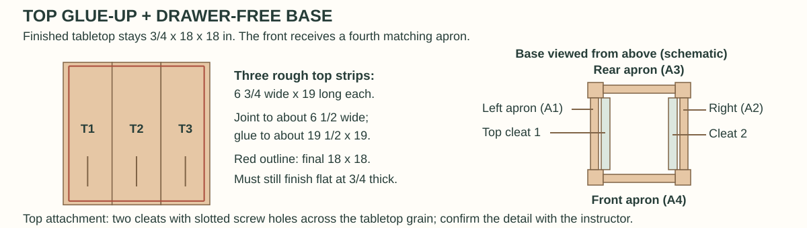

# Cutting diagram for the purchased poplar

**Current build, 2026-10-08: poplar throughout, square-stock legs, no drawer.** This layout uses the two approximately 5-ft boards and four 30-in leg blanks already purchased. It includes every wooden part for the revised table, plus the jointing and planing needed to bring the stock to size.

The flat boards are recalled as **1x8**, not yet measured. The layout fits the reported lengths if the width, thickness, defects and milling checks below pass. The shop has a jointer and planer; have the instructor set the milling sequence and permitted workpiece sizes before breaking the boards into short sections.

All three-dimensional sizes are **thickness x width x length, in inches**. Two-dimensional rough sizes are explicitly labeled **width x length**. The [project decision log](PROJECT_BASE.md#current-decisions) records the changes. Earlier hypothetical cherry-and-drawer layouts remain in the [September examples](CUTTING_DIAGRAM_2026-09-24.md).

## The whole table

The center of the tabletop is hidden only in this drawing so the supports can be seen. The finished tabletop is a complete solid 18 x 18-in panel. Green strips are the two top cleats.

## What changes when the drawer is omitted

Use **four matching aprons**: left, right, rear and a new full-width front apron. The proposed front repeats the original rear-apron joint, subject to the instructor checking the layout. The finished top stays 3/4 x 18 x 18 in, height about 27 1/2 in, and base footprint about 14 x 14 in.

- Add one 3/4 x 5 x 12 1/2-in front apron, including its two 3/8-in-long tenons.
- Both front legs now receive apron mortises on two adjacent inside faces, like the rear legs. Omit the former front-rail mortises and dovetail sockets.
- Omit both narrow front rails, the entire drawer, the two lower guides, both spacers and the knob.
- Retain two original upper-guide pieces as **top cleats**: strips inside the side aprons for attaching the tabletop with slotted screw holes.
- Retain the two inside-face leg tapers and the original top bevel. Test the finish on poplar before choosing the class finish schedule.

The rear-corner detail above is from Christopher Schwarz's source drawing, [PDF page 4](https://www.popularwoodworking.com/app/uploads/2010/10/HiRes-SEPT2004-Seg2.pdf#page=4). Repeating this joint at the front is our drawer-free adaptation. Its 3/8-in-thick, 3/8-in-long apron tenons and 3/16-in apron setback remain the reference; fit tenons to the actual mortises.

## Purchased stock

| Piece | Reported purchase size | What must be measured |
|---|---|---|
| Poplar board 1 | About 60 in long; recalled as nominal 1x8 | Actual thickness, clear width, length, twist, cup, bow and end checks |
| Poplar board 2 | About 60 in long; recalled as nominal 1x8 | Same checks; assign the sounder/longer board to the tighter board-2 layout |
| Four poplar leg blanks | Each 1 1/2 x 1 1/2 x 30 in | Actual cross-section, clear length, straightness and grain on all faces |
| Poplar square-stock remainder | From the original 1 1/2 x 1 1/2 x 168-in stick | Actual remaining length and usable grain; reserve for tests or a spare only after measuring |

The flat stock began as one 10-ft board cut into two pieces by the dealer. The cut removes some length, so both pieces may be slightly under 60 in. The square-stock arithmetic is `168 - (4 x 30) = 48 in` **before dealer kerfs and trimming**; it is not a measured 48-in remainder.

## Rough blanks and finished parts

These rough allowances are revised to fit the purchased lengths. Top sections change from 21 to 19 in; apron and cleat sections change from 14 to 13 in. Finished design dimensions remain unchanged, except for the explicitly added front apron and omitted drawer components.

| Qty. | Part and marking label | Proposed rough width x length (in) | Finished thickness x width x length (in) |
|---:|---|---|---|
| 4 | Legs 1-4 (L1-L4) | Keep the full purchased 30-in length while milling; start from the reported 1 1/2-in square | 1 1/8 x 1 1/8 x 26 3/4 |
| 3 | Top strips 1-3 (T1-T3) | 6 3/4 x 19 each | Together form one 3/4 x 18 x 18 top |
| 4 | Left, right, rear, front aprons (A1-A4) | 5 1/2 x 13 each | 3/4 x 5 x 12 1/2 each, including tenons |
| 2 | Top cleats 1-2 (TC1-TC2) | 1 1/4 x 13 each | 3/4 x 1 x 12 1/8 each; fit/notch at the legs |

Keep the flat stock's purchased thickness until the milling plan is checked. It must yield flat 3/4-in parts; the top also needs allowance for final panel cleanup. The leg cross-section reduces from a reported 1 1/2 in to 1 1/8 in: **3/8 in total reduction in each cross-sectional dimension**, not 3/8 off every face. An intermediate 1 3/8-in square is optional if the actual stock and class sequence call for a rough-milling stage.

The letters are simply labels to write on the wood: **L = leg, T = top strip, A = apron, TC = top cleat**. There are no drawer-side or drawer-bottom labels in this build.

## Board 1 supplies two top strips and the left apron

At an actual 60-in length, the full allocation is:

`1 total end reserve + 19 + 19 + 13 + (3 x 1/8 kerf) + 7 5/8 reserve = 60 in`.

Rip **top cleat 1** from the strip beside the left apron. The 7 5/8-in remainder is a reserve, subject to actual board length and defects. It is not automatically long enough for a machine setup test.

## Board 2 supplies the last top strip and three aprons

At an actual 60-in length, the full allocation is:

`1 total end reserve + 19 + 13 + 13 + 13 + (4 x 1/8 kerf) + 1/2 reserve = 60 in`.

Rip **top cleat 2** from the strip beside the right apron. This layout needs **at least 59 1/2 in** with the stated 1/2-in reserve at each end, including squaring cuts. If the actual board is shorter than that, or requires more end cleanup, revise the layout with the instructor before cutting. Do not shorten the finished aprons to force a fit.

### Width thickness and saw-loss checks

- Both diagrams show **6 7/8 in of clear usable width after initial edge cleanup**. Each apron-and-cleat section uses `5 1/2 + 1/8 rip kerf + 1 1/4 = 6 7/8 in`. A top reservation uses 6 3/4 in plus a 1/8-in separating rip kerf.
- Three rough 6 3/4-in top strips can each lose 1/4 in in total width to edge preparation, producing an approximately 19 1/2-in-wide glue-up. The 19-in rough length leaves 1 in total for final trimming to 18 in, including subsequent saw loss. Check for snipe and end defects within this allowance.
- Aprons retain 1/2 in total extra width and 1/2 in total extra length. Cleats retain 1/4 in extra width and 7/8 in extra length. These are modest allowances; increase them if actual milling loss demands it and recheck the packing.
- A nominal 1x8 may be about 3/4 x 7 1/4 in when surfaced, but the name alone does not establish these boards' measured size. If they are already 3/4 in thick and need flattening, the planer will take them below the article's target. Measure first; any thinner design needs a recorded revision to apron tenons, setbacks, cleats, top bevel, screw penetration and overall height.
- **1/8 in is a planning saw kerf.** Measure the shop blade and recalculate if different. The gray end reserves include end-squaring saw loss; the red lines reserve the separating cuts. These are material allocations, not a required machine-cutting order.

## The four purchased legs

Keep each blank at its full 30-in length during inspection and initial milling. Joint and plane square with the instructor's workholding to reach **1 1/8 x 1 1/8 in**. The final 26 3/4-in length leaves **3 1/4 in total** for trimming and saw loss. Do not add the old diagram's two 1-in end reserves around a 29-in blank; that would exceed the wood now available.

Label each leg and its two outside faces before joinery. After the apron joints are fitted, taper only the two inside faces, beginning 1 in below the apron bottom and ending at a 5/8-in-square foot. Confirm the taper jig or supported hand-tool method with the instructor.

## Top glue-up and revised base

The two top cleats lie inside the side aprons. Fit their ends and the source's 3/16 x 3/16-in corner notches to the assembled base. Install them flush with, or just below, the apron tops. Drill and elongate the attachment holes to permit movement **across the tabletop grain**. The source uses #8 x 1-in screws; confirm actual penetration and hole positions with the instructor before fastening the top.

## Jointing and planing at the shop

The class machines are part of this plan. Their setup and minimum workpiece sizes determine when to release the small parts.

1. **Measure and mark first.** Bring a tape/rule, calipers, straightedge, square and pencil. Record dimensions and defects, orient the top grain, mark the two board layouts and identify the outside leg faces. Keep the full length of each leg blank.
2. **Choose manageable parent pieces.** Have the instructor approve initial breakdown and minimum safe machine lengths. Keep the apron groups longer and full width through milling where needed; do not crosscut all the 13-in reservations into separate pieces first. Keep each cleat attached to its wider parent until the relevant face/thickness work is done.
3. **Establish reference surfaces.** Joint one face flat and an edge straight/square to it, using the shop's guards and push blocks. Plane the opposite face parallel, leaving the top enough material for its later panel cleanup. Mill matching apron stock to one consistent thickness. The instructor may adjust the order of face, edge and thickness work for the stock.
4. **Bring widths and lengths down in stages.** Rip with the reference edge against the fence, leaving the edge-cleanup allowance shown. Joint or securely hand-plane to final width. Use approved narrow-rip workholding for the cleats. Square and trim ends last, retaining all tenon length in the aprons. Legs finish at 1 1/8 in square and 26 3/4 in long before their final layout/tapers.
5. **Fit the joinery and dry-assemble.** Use shop-safe poplar test stock at the same thickness; confirm mortises before fitting tenons. Dry-fit the complete four-apron base before glue-up. Check diagonals, twist, leg orientation and 3/16-in apron setbacks. Dry-clamp the top to check mating edges and flatness before gluing it.

**Stopping point for the next class:** measured inventory, reference faces marked, every part reserved, and instructor agreement on the four-apron front, milling order and top attachment. Keep final dimensions and joinery uncut until those checks pass. If the layout consumes all usable stock, obtain a separate shop-safe test piece rather than relying on a short end reserve.

## Actual inventory worksheet

Reported purchase sizes above are separate from the blank measurement record below. Fill this in at the shop; dimension order is thickness x width x length.

| Piece | Measured T x W x L (in) | Usable size after checks | Reference face or edge | Defects and notes |
|---|---|---|---|---|
| Poplar board 1 |  |  |  |  |
| Poplar board 2 |  |  |  |  |
| Leg 1 |  |  |  |  |
| Leg 2 |  |  |  |  |
| Leg 3 |  |  |  |  |
| Leg 4 |  |  |  |  |
| Square-stock remainder |  |  |  |  |

## How much wood

The current material plan assigns **4 legs, 3 top strips forming one top, 4 aprons and 2 top cleats**. No required piece is assigned twice. Test-stock adequacy still depends on the measured remainder and shop minimums. The original article's approximately 12-board-foot estimate was for its cherry table with a drawer; it is not the tally for this revised purchase. Use the actual measured boards and dealer invoice for that tally.

## Sources and earlier examples

Christopher Schwarz, "Simple Shaker End Table," *Woodworking Magazine*, Autumn 2004, pages 16-21. [Publisher's original PDF](https://www.popularwoodworking.com/app/uploads/2010/10/HiRes-SEPT2004-Seg2.pdf): article cut list on PDF page 3, drawing on page 4, assembly and top attachment on pages 5-6. David Thiel's panel-glue-up companion is on PDF pages 7-8.

The source establishes the original design dimensions. The purchased-stock layouts and four-apron adaptation are project planning drawings dated 2026-10-08. The [earlier cherry, drawer and square-stock purchase examples](CUTTING_DIAGRAM_2026-09-24.md) are retained for comparison and do not describe the current build. Printed handouts are supplied separately and are not hosted on this website.
