# Lumber and woodworking terminology

This is a beginner's reference for the Shaker end table project. It explains how lumber is named and sold, how to read the plan's measurements, and what the table and joinery terms mean.

Keep this distinction in mind:

- A **lumber size** may be a trade name or rough size rather than the board's current measured size.
- A **cut-list size** is usually the finished size the part must reach after milling.

## On this page

- [How to read any string of numbers](#how-to-read-any-string-of-numbers)
- [Thickness, width, length, and height](#the-three-measurements-of-a-board)
- [Fractions and measurement symbols](#fractions-used-in-the-plan)
- [Nominal size versus actual size](#nominal-size-versus-actual-size)
- [Hardwood quarter-thickness](#hardwood-thickness-44-54-64-and-84)
- [Board feet and sales units](#board-feet-and-other-ways-lumber-is-sold)
- [Rough size, finished size, allowance, and kerf](#rough-size-finished-size-and-cutting-allowance)
- [Names and full dimensions of the table parts](#parts-of-this-table)
- [Joinery terms](#joinery-terms)
- [Shape, fit, and layout terms](#shape-and-layout-terms)
- [Grain and cut direction](#grain-and-board-orientation)
- [Common board defects](#defects-and-movement)
- [Project notation translated into plain language](#translation-of-this-projects-common-notations)

## Five things to remember first

1. A `2x4` names only a nominal thickness and width. It does not include length. The board commonly measures about 1 1/2 x 3 1/2 in across its end.
2. Hardwood names such as `4/4` and `8/4` describe nominal rough-thickness categories, not guaranteed finished measurements.
3. This project's cut list gives finished sizes in thickness x width x length order.
4. A board foot measures wood volume, not board length.
5. Always measure the actual board and leave clearly labeled milling allowance before cutting finished parts.

## How to read any string of numbers

The multiplication sign `x` means **“by.”** It separates dimensions; it does not mean you should multiply them unless you are calculating area or volume.

First ask **what object is being measured**. The same-looking numbers can describe different things:

| Notation | Object being measured | Read it as |
|---|---|---|
| `3/4 x 5 x 12 1/2 in` | A rectangular table part | 3/4 in thick x 5 in wide x 12 1/2 in long |
| `2x4` | A construction-lumber trade size | Nominal 2-in thickness x nominal 4-in width; no length is stated |
| `2x4x8 ft` | A construction board | Nominal 2-in thickness x nominal 4-in width x 8-ft length |
| `1/2-in-wide x 1/4-in-deep rabbet` | An L-shaped cut | The cut reaches 1/2 in inward from the edge and 1/4 in down into the face |
| `3/8-in-thick x 5/8-in-wide x 3/4-in-long tenon` | A projecting tongue | Its cross-section is 3/8 x 5/8 in and it projects 3/4 in from its shoulder |
| `#8 x 1 in screw` | A screw | Number 8 gauge x 1 in long; it does not mean eight screws |

When a plan gives only one or two dimensions, it is usually describing only the feature that matters. For example, `3/16-in setback` gives a distance between two faces; it is not a complete part size. Never assume an omitted dimension—look at the drawing, cut list, or assembled work.

## The three measurements of a board

Woodworking cut lists commonly use this order:

**thickness x width x length**

Think of the measurements this way:

- **Thickness** goes through the board, from one broad face to the other.
- **Width** goes across the broad face, from one long edge to the other.
- **Length** follows the long direction of the board, usually along the grain.

Raw lumber does not have a permanent **height**. Height describes how a board or finished object is positioned. If you stand an 8-ft board vertically, its 8-ft length becomes its installed height. If you turn the same board horizontally, its length runs sideways. The board itself still has thickness, width, and length.

For example, the table's apron size is:

`3/4 x 5 x 12 1/2 in`

That means:

- **Thickness:** 3/4 in
- **Width:** 5 in
- **Length:** 12 1/2 in

The dimensions describe the finished part. They do not tell you the rough board size to buy.

### Thickness

Usually the smaller cross-section dimension on an ordinary board. Thickness is measured between the two broad faces. A board described as `3/4 in thick` should finish at that measurement after flattening and planing.

### Width

The distance across the broad face of the board. Width is usually measured across the grain.

### Length

The long dimension of the board, running along the grain.

### Height

Height is not normally one of the three dimensions used to identify a loose board. It describes a board's orientation after it is placed in a structure, or the vertical size of a finished object. This table's `27 1/2 in` height means the vertical distance from the floor to the top of the table.

### Face, edge, and end

- A **face** is one of the two broad **width x length** surfaces.
- The **edge** is one of the two narrow **thickness x length** surfaces.
- The **end** shows the **thickness x width** cross-section.

For a common actual 2x4, the end is about 1 1/2 x 3 1/2 in. The 8-ft or 10-ft dimension runs away from that end along the board.

### Examples from this table

| Part and listed size | Thickness | Width | Length |
|---|---:|---:|---:|
| Apron: `3/4 x 5 x 12 1/2 in` | 3/4 in | 5 in | 12 1/2 in |
| Leg: `1 1/8 x 1 1/8 x 26 3/4 in` | 1 1/8 in | 1 1/8 in | 26 3/4 in |
| Top: `3/4 x 18 x 18 in` | 3/4 in | 18 in | 18 in |

The leg is described as **square** because its thickness and width are equal. The top also has equal width and length, but it is a thin panel rather than a square stick.

### Square

When a plan says a leg is `1 1/8 in square`, both its thickness and width are 1 1/8 in. It does not describe its length.

### Overall length and shoulder-to-shoulder length

The cut-list length normally means the part's total length, including any tenons or dovetails on its ends, unless the drawing explicitly says otherwise. The **shoulder-to-shoulder length** is the visible distance between the joint shoulders after assembly.

For this project, do not subtract the tenons from the listed apron length when rough-cutting the part. The apron is listed as 12 1/2 in overall, including the two 3/8-in-long tenons.

## Fractions used in the plan

An inch is commonly divided into halves, quarters, eighths, and sixteenths.

| Written size | Read aloud | Decimal equivalent |
|---:|---|---:|
| 1/2 in | one-half inch | 0.500 in |
| 1/4 in | one-quarter inch | 0.250 in |
| 3/4 in | three-quarter inch | 0.750 in |
| 1/8 in | one-eighth inch | 0.125 in |
| 3/8 in | three-eighths inch | 0.375 in |
| 5/8 in | five-eighths inch | 0.625 in |
| 1/16 in | one-sixteenth inch | 0.0625 in |
| 3/16 in | three-sixteenths inch | 0.1875 in |
| 1 1/8 in | one and one-eighth inches | 1.125 in |
| 12 1/2 in | twelve and one-half inches | 12.500 in |

On a tape measure, the shortest marks are often sixteenths, but tape designs vary. Count from a labeled inch mark and identify the longest fractional line first: half, quarter, eighth, then sixteenth.

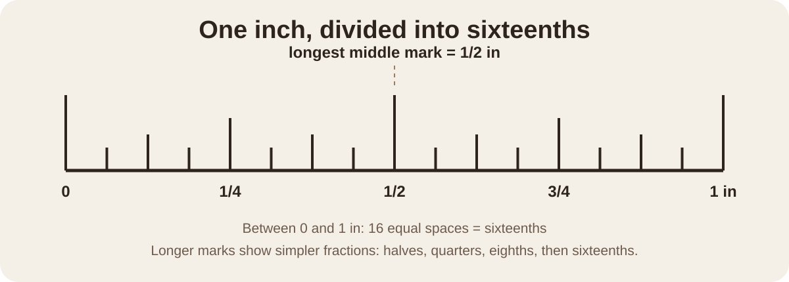

To read a mark, count how many equal spaces it is past the last whole inch and reduce the fraction. For example, 6/16 in is the same as 3/8 in. A measurement at 12 whole inches plus the eighth mark is `12 1/8 in`.

### Feet, inches, diameter, and angles

| Mark | Meaning | Example |
|---|---|---|
| `ft` or `'` | feet | `8 ft` or `8'` means 96 in |
| `in` or `"` | inches | `12 1/2 in` or `12 1/2"` |
| `Ø` or `dia.` | diameter across a circle through its center | `Ø 7/8 in` knob |
| `°` | angle in degrees | `7°` bevel setting; `90°` square corner |
| `#` before a screw number | screw gauge, not quantity | `#8 x 1 in` screw |
| `#` before sandpaper grit | abrasive grit size | `#120` is coarser than `#220` |

## Nominal size versus actual size

**Nominal size** is the trade name used to sell the lumber. **Actual size** is what the board measures now.

### Why a 2x4 is not 2 x 4 in

A North American construction `2x4` began historically as a board sawn close to 2 x 4 in. Drying and surfacing remove material. Modern dimensional lumber sold as a 2x4 is normally about 1 1/2 x 3 1/2 in across its end.

The name `2x4` describes only the board's **nominal cross-section**:

- Nominal thickness: 2 in
- Nominal width: 4 in
- Length: not stated

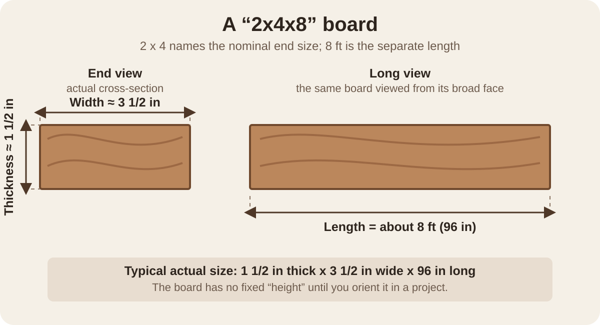

At a store, the length appears separately. A board labeled `2x4x8` or `2 in x 4 in x 8 ft` means:

| Label position | What it means | Common actual measurement |
|---|---|---:|
| First number: `2` | Nominal thickness | About 1 1/2 in |
| Second number: `4` | Nominal width | About 3 1/2 in |
| Third number: `8 ft` | Board length | About 8 ft, or 96 in |

So a typical `2x4x8` is approximately **1 1/2 in thick x 3 1/2 in wide x 96 in long**. A `2x4x10` has the same cross-section but is about 10 ft long. Lengths offered by a store vary, and the actual board should always be measured.

Common construction-lumber examples are:

| Nominal cross-section | Actual thickness | Actual width | Length |
|---:|---:|---:|---|
| 1x4 | 3/4 in | 3 1/2 in | Purchased separately |
| 1x6 | 3/4 in | 5 1/2 in | Purchased separately |
| 1x8 | 3/4 in | 7 1/4 in | Purchased separately |
| 2x4 | 1 1/2 in | 3 1/2 in | Purchased separately |
| 2x6 | 1 1/2 in | 5 1/2 in | Purchased separately |
| 2x8 | 1 1/2 in | 7 1/4 in | Purchased separately |

These conventions mainly apply to standardized construction softwood. They are not the usual way hardwood dealers sell cherry or poplar.

Always measure the actual board. Store labels, local standards, moisture loss, and additional surfacing can change the final measurement.

### Why the 4 is called width instead of height

The board can be rotated, so the 3 1/2-in dimension is not permanently vertical. Woodworkers still call the broad cross-section dimension **width**, even when a board is standing on edge and that dimension appears vertical. **Height** belongs to the board's use or to the finished object, not to the lumberyard name.

### Hardwood and softwood

These names refer to broad botanical groups, not a guarantee of physical hardness. Cherry and poplar are hardwoods because they come from flowering deciduous trees. Some hardwoods are softer than some softwoods. Pine, spruce, fir, and cedar are common softwoods.

### Dimensional or construction lumber

Standardized boards such as 2x4s that are primarily sold for building construction. Their nominal and actual sizes follow established building-lumber conventions. Furniture hardwood is commonly sold under the quarter-thickness and board-foot systems described below.

### Plywood is also commonly nominal

A sheet sold as `3/4-in plywood` may measure 23/32 in or another nearby thickness. Drawer grooves must fit the actual sheet or solid-wood bottom, not the label.

## Hardwood thickness: 4/4, 5/4, 6/4, and 8/4

Hardwood dealers commonly describe rough thickness in quarters of an inch. The slash is read as **quarter**, not as a fraction to simplify.

| Hardwood name | Read aloud | Nominal rough thickness | Typical possible finished thickness* |
|---:|---|---:|---:|
| 4/4 | four-quarter | about 1 in | about 3/4 in |
| 5/4 | five-quarter | about 1 1/4 in | about 1 in |
| 6/4 | six-quarter | about 1 1/2 in | about 1 1/4 in |
| 8/4 | eight-quarter | about 2 in | about 1 1/2 to 1 3/4 in |

\*Finished yield varies with the dealer, drying, board flatness, and how much material milling removes. Ask for the actual measured thickness before buying.

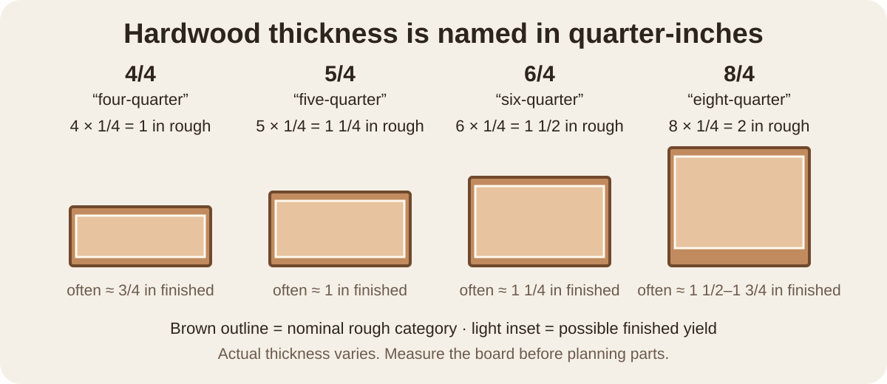

The article says the leg stock is sold as **8/4 cherry** and measures about 1 3/4 in thick in the rough. That extra thickness lets the builder rotate a 1 3/8-in template on the end grain and select a good-looking 1 1/8-in-square leg from within the larger board.

The term `8/4` therefore describes the stock category being purchased. The term `1 1/8 in square` describes the finished leg blank.

The quarter name describes **thickness only**. It says nothing about width or length. An `8/4` cherry board might be 7 in wide and 9 ft long, while the next `8/4` board could have different width and length.

## Rough and surfaced lumber

### Rough or rough-sawn

A board that has not been fully flattened and smoothed after sawing and drying. Its faces may show saw marks, and its edges may not be straight or square.

### Surfaced lumber

Lumber that a dealer has machined. Common abbreviations include:

| Marking | Meaning |
|---|---|
| RGH or rough | No faces or edges guaranteed flat and smooth |
| S2S | Surfaced on two broad faces; edges may remain rough |
| S3S | Surfaced on two faces and one edge |
| S4S | Surfaced on all four sides |

Dealer usage can vary, so ask which surfaces are prepared and what the actual dimensions are.

Here, **four sides** means the two broad faces plus the two long edges. It does not include the two ends. `S4S` does not promise a particular length, does not mean the ends were cut square, and does not replace measuring the actual thickness and width.

### Straight-line ripped, or SLR

One edge has been sawn straight to provide a reference edge. This is sometimes sold as `SL1E`, meaning straight-line ripped on one edge.

An SLR edge is a starting reference for ripping the opposite edge. It does not mean the two faces are flat, that the opposite edge is parallel, or that the board is at finished width.

### Kiln-dried and air-dried

- **Kiln-dried:** Dried in a controlled heated chamber.
- **Air-dried:** Dried by circulating ambient air, usually more slowly.

Either can be suitable furniture lumber if its moisture content is appropriate and stable for the shop and final room. The instructor or lumber dealer can help check this.

### Moisture content and acclimation

**Moisture content** is the amount of water in the wood, normally reported as a percentage. **Acclimation** means allowing lumber time in the shop environment before final milling so its moisture and shape can approach a stable condition. Neither word supplies a universal number of days or a target percentage; use the instructor's meter, shop conditions, and guidance.

## Hardwood grades and clear stock

Hardwood grades estimate how much clear, usable material can be cut from a board. They do not directly rank color, grain beauty, or suitability for every furniture part.

### FAS

`FAS` is a high hardwood grade intended to provide a high yield of large clear cuttings. The initials come from `Firsts and Seconds`, although modern grading rules treat FAS as one grade.

### Select or FAS 1-Face

Grades that can provide high-quality clear material but allow one face or board size to meet different requirements. Exact retail usage varies.

### Common grades

Grades such as No. 1 Common allow smaller clear cuttings and more defects. They can be economical for projects made from small parts, but require careful layout.

### Clear

A board area without knots, checks, splits, or other defects that would interfere with the intended part. `Clear` can be an ordinary description rather than a formal retail grade.

For this project, appearance and grain orientation matter as much as grade. Inspect each board rather than buying by the grade name alone.

## Board feet and other ways lumber is sold

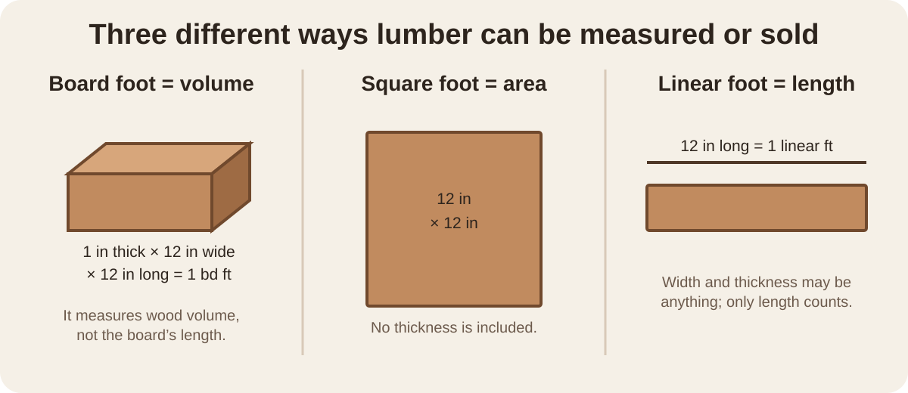

### Board foot

A **board foot** is a volume equal to a board 1 in thick, 12 in wide, and 12 in long. It is not a length.

For measurements in inches:

`board feet = thickness x width x length / 144`

Example: a rough board 1 in thick, 8 in wide, and 96 in long contains:

`1 x 8 x 96 / 144 = 5.33 board feet`

All three numbers in that calculation are **actual board dimensions in inches**: 1 in thick, 8 in wide, and 96 in long. Dividing by 144 converts that volume into board feet because `1 x 12 x 12 = 144` cubic inches.

For a board measured in inches by inches by feet:

`board feet = thickness x width x length in feet / 12`

Hardwood dealers may calculate using the nominal rough thickness and their own rounding rules. Ask how the tally is calculated.

The source article estimates about **12 board feet** for the table. This is an approximate project estimate, not a calculation of the finished parts' volume or a guaranteed shopping quantity. The listed rectangular parts total about **5.10 board feet** before tapering, beveling, and cutting joints. A purchase list must also allow for defects, kerfs, milling loss, grain selection, board widths, test cuts, and the supplier's available stock. See the [cutting diagram and lumber plan](CUTTING_DIAGRAM.md#how-much-wood).

### Linear foot

One foot of length, regardless of board width or thickness. Trim and some surfaced lumber may be priced by the linear foot.

Example: 6 linear ft of a 1x4 and 6 linear ft of a 1x8 have the same linear-foot count even though the 1x8 contains more wood.

### Square foot

An area 12 x 12 in. Sheet goods and veneer may be discussed by area, though full sheets are often sold by the sheet.

Square feet describe face area only. Thickness is a separate specification: a 4 x 8 ft sheet has 32 square ft of face area whether it is 1/4 in or 3/4 in thick.

### Random width and random length

Many hardwood boards are sold in varying widths and lengths rather than standard construction-lumber sizes. A cutting diagram must be based on the boards actually available, or on stated assumed board sizes.

## Rough size, finished size, and cutting allowance

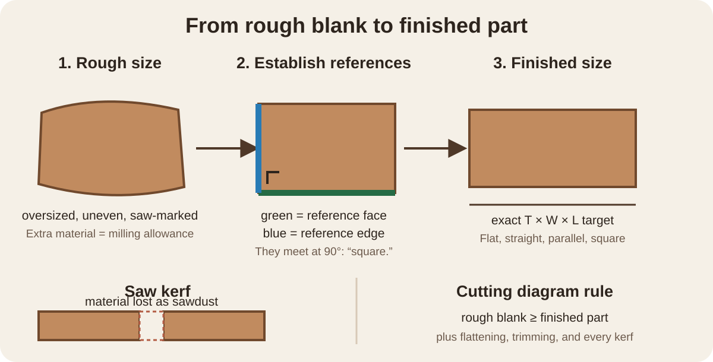

### Rough size

The intentionally oversized dimension used before final milling. Extra material allows the part to be flattened, squared, and trimmed to final length.

A useful rough-size entry still needs all three dimensions and a label. For example, `rough blank: 1 x 5 1/4 x 13 in` is clearly different from `finished apron: 3/4 x 5 x 12 1/2 in`. The added 1/4 in of thickness, 1/4 in of width, and 1/2 in of length are allowances in this example, not universal rules.

### Finished size

The target size after milling. The Shaker table cut list contains finished sizes.

### Milling allowance

Extra thickness, width, or length left on a rough blank so defects and machine marks can be removed. Allowance is not a universal fixed number; it depends on stock condition, tools, grain, and class practice.

### Kerf

The slot removed by a saw blade. Its width is lost as sawdust. A cutting diagram must leave room for every saw kerf and for any later jointing or trimming.

If two parts need 12 in of finished length each and the blade makes a 1/8-in kerf, their cuts consume at least `12 + 1/8 + 12 = 24 1/8 in` before adding end-trimming allowance. The actual blade and setup determine the real kerf.

### Reference face and reference edge

The first flat face and first straight edge established during milling. All layout and machine settings are related to these references so the part becomes flat, square, and consistent.

### Square

This word has two common meanings:

- A part has equal width and thickness, as in a square leg.
- Two faces or edges meet at 90 degrees, as in a board that has been milled square.

## Parts of this table

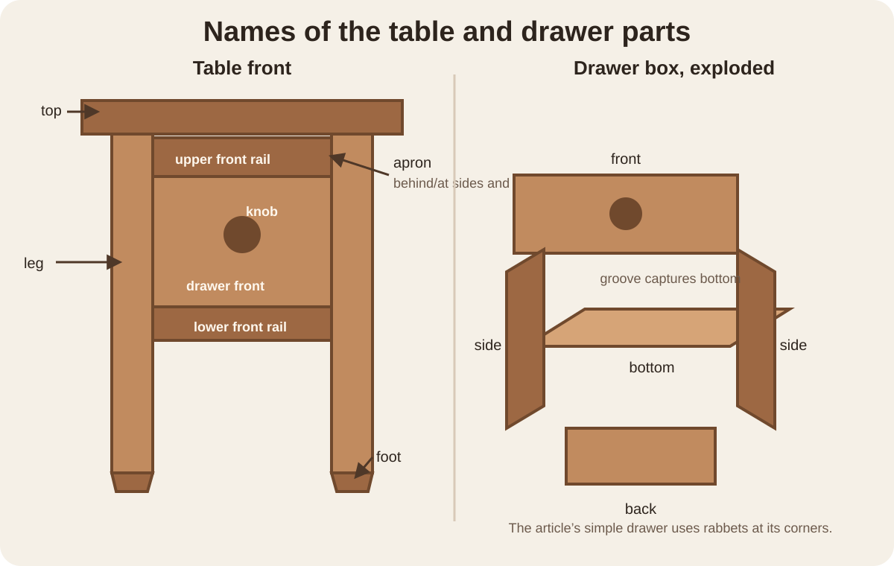

The article cut list uses **finished thickness x finished width x finished overall length**. Splitting the sizes into separate columns makes every number explicit:

| Qty. | Part | Thickness | Width | Overall length | Important shape or joint |
|---:|---|---:|---:|---:|---|
| 4 | Legs | 1 1/8 in | 1 1/8 in | 26 3/4 in | Two inside faces taper to a 5/8 x 5/8 in foot |
| 1 | Top | 3/4 in | 18 in | 18 in | Underside bevel is 2 in wide, removes 1/4 in vertically, and leaves a 1/2-in-thick edge |
| 3 | Aprons | 3/4 in | 5 in | 12 1/2 in | Overall length includes a 3/8-in-long tenon at each end |
| 2 | Front rails | 3/4 in | 3/4 in | 13 1/4 in | Lower rail has tenons; upper rail has dovetails |
| 4 | Drawer guides | 3/4 in | 1 in | 12 1/8 in | Each gets a 3/16 x 3/16 in corner notch |
| 2 | Spacers | 3/16 in | 3/4 in | 11 3/4 in | Glued to the aprons |

The article's simple rabbeted-drawer sizes are:

| Qty. | Drawer part | Thickness | Width | Overall length | Important shape or joint |
|---:|---|---:|---:|---:|---|
| 1 | Front | 3/4 in | 3 1/2 in | 11 3/4 in | Ends receive 1/2-in-wide x 1/4-in-deep rabbets |
| 2 | Sides | 1/2 in | 3 1/2 in | 12 1/4 in | Fit to the assembled opening |
| 1 | Back | 1/2 in | 3 in | 11 3/4 in | Ends receive 1/2-in-wide x 1/4-in-deep rabbets |
| 1 | Bottom | 1/2 in | 11 1/4 in | 12 3/8 in | Edges are rabbeted to fit a 1/4-in-wide x 1/4-in-deep groove |

These are article baselines, not buying sizes. Drawer sizes depend on the assembled opening, installed top, and the class's choice of rabbeted or dovetailed construction.

### Top

The horizontal surface of the table. This top is a glued-up solid-cherry panel, finished at **3/4 in thick x 18 in wide x 18 in long**. Because the square face is 18 x 18 in, either face direction can be called width; the grain direction should still be recorded.

### Leg

A vertical support. Each finished blank is **1 1/8 in thick x 1 1/8 in wide x 26 3/4 in long**. When installed vertically, that 26 3/4-in length contributes to the table's height. Only the two inside faces taper, ending at a foot **5/8 in thick x 5/8 in wide**.

### Foot

The bottom end of a leg. It is not a separate part in this design.

### Apron

A horizontal board connecting the legs just below the top. Each apron finishes at **3/4 in thick x 5 in wide x 12 1/2 in overall length**. Aprons stiffen the base and resist racking. This table has two side aprons and one rear apron. The open front uses upper and lower rails around the drawer opening.

### Rail

A horizontal frame member. Each front rail finishes at **3/4 in thick x 3/4 in wide x 13 1/4 in overall length**. The **upper front rail** and **lower front rail** connect the front legs while leaving room for the drawer.

### Drawer front

The visible front board of the drawer. It is cherry so it matches the table.

This is an **inset drawer**: the front fits inside the opening with a narrow reveal on all four sides. An **overlay drawer** has a front that overlaps or covers part of the opening.

### Drawer side and drawer back

The boards forming the sides and rear of the drawer box. The article specifies poplar.

### Drawer bottom

The horizontal panel inside the drawer. Its edges fit into grooves in the front and sides.

### Drawer guide

One of four internal strips, each **3/4 in thick x 1 in wide x 12 1/8 in long**, that control the drawer. The two lower guides provide running surfaces. The two upper guides prevent the open drawer from tipping and also carry the holes used to attach the tabletop. Each guide has a **3/16-in-wide x 3/16-in-deep corner notch** where it fits around a leg.

### Drawer runner

A strip associated with the drawer's sliding path. Woodworkers sometimes use `runner`, `guide`, and `kicker` differently. In this project, use the source plan's part names and confirm the location in the drawing rather than relying only on the word.

### Kicker

An upper strip that keeps an opened drawer from tipping downward by limiting how far its back can rise. The two upper drawer guides perform this job in this table.

### Spacer

A thin strip that establishes or fills a particular gap. Each spacer is **3/16 in thick x 3/4 in wide x 11 3/4 in long** and is glued to an apron as part of the drawer-guiding arrangement.

### Drawer stop

A small removable piece that prevents the drawer from being pulled completely out accidentally.

### Knob

The drawer pull. The source specifies a Shaker-style cherry knob approximately **7/8 in diameter** with a **3/8-in-diameter mounting tenon**. Diameter is measured straight across the circular part through its center.

## Joinery terms

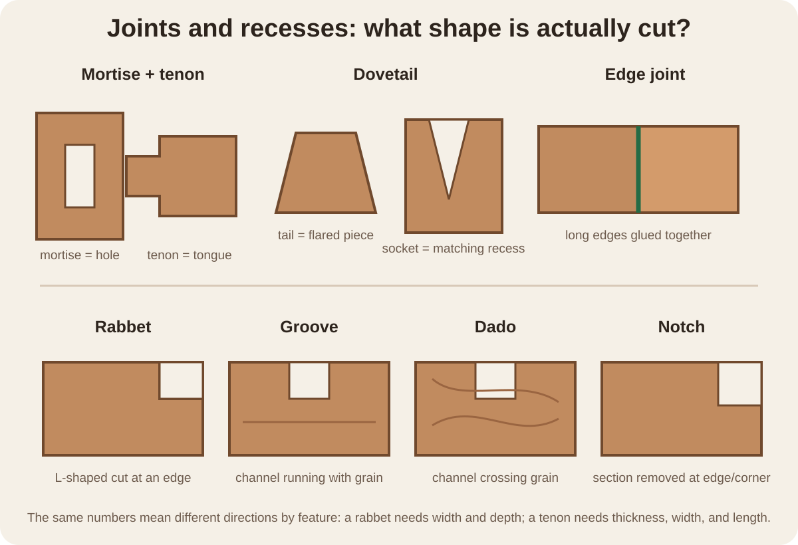

Joint measurements describe the **cut feature**, not necessarily the whole board. For a rectangular mortise or tenon, name thickness, width, and depth or projecting length. For a rabbet, groove, dado, or notch, name width across the cut and depth into the wood. If the plan does not label that order, use the drawing or written words rather than guessing.

### Joint

Any place where two pieces of wood connect.

### Mortise

A rectangular hole or recess cut into one part. On this table, the apron mortises are cut in the legs. The opening's dimensions are **mortise thickness x mortise width**; the inward measurement is **depth**. A matching tenon must be sized from the actual mortise.

### Tenon

A projecting tongue on the end of a part that fits into a mortise. A tenon has **thickness** across its narrow direction, **width** across the tongue, and **length** from shoulder to tip. The apron drawing specifies **3/8 in thick x 3/8 in long**; its remaining width is governed by the mortise and shoulder layout. The lower front-rail tenon is **3/8 in thick x 5/8 in wide x 3/4 in long**.

### Mortise-and-tenon joint

The completed joint formed by a tenon fitting into a mortise. It provides a large long-grain glue area and resists the forces that make a table rack.

### Tenon cheek

One of the broad, flat surfaces of a tenon. Removing material from the two cheeks makes the tongue thinner. The distance from one cheek to the other is the **tenon thickness**, which controls how tightly it fits the mortise.

### Shoulder

The step where the full-size part meets the smaller tenon. The shoulder closes against the mating part, hides the mortise edges, and helps establish the assembled length. **Tenon length** is measured from shoulder to tip; **shoulder-to-shoulder length** is measured between the shoulders at opposite ends.

### Dovetail

A joint with a flared, trapezoid-like shape that mechanically resists being pulled apart. Dovetails are often used at drawer corners. On this table, one **3/4-in-long** dovetail at each end of the upper front rail fits into a socket in a front leg. The source suggests an angle of about **8°** and says the exact tail size and slope are not critical for this concealed joint.

### Tail

The flared projecting part of a dovetail joint.

### Socket

The recess cut to receive the tail. In this table, the upper-rail dovetail shape is transferred directly to the legs, then the sockets are cut to those marks.

### Rabbet

An L-shaped recess along the edge or end of a board. Describe it as **width inward from the edge x depth down from the face**. The simple drawer option uses a rabbet **1/2 in wide x 1/4 in deep** at each end of the front and back to receive a 1/2-in-thick side. The source cut-list note prints the same two numbers as `1/4 x 1/2`; the drawer article supplies the direction words that remove the ambiguity.

### Groove

A long, narrow channel cut with the grain. Describe it as **channel width x depth**. The drawer-bottom groove is **1/4 in wide x 1/4 in deep** and runs along the drawer front and sides.

### Dado

A channel cut across the grain. A groove and a dado can have the same cross-section; their direction relative to the grain gives them different names.

### Notch

A section removed from an edge or corner. Each drawer guide receives a notch **3/16 in wide x 3/16 in deep** so it fits around a leg. Because this is a square corner notch, the two numbers happen to be equal.

### Edge joint

The joint between the long edges of boards glued side by side to make a wider panel, such as the tabletop.

### Glue-up

The stage when glue is applied and parts are clamped together. The assembled result may also be called a glue-up.

### Dry fit

Assembling parts without glue to check fit, square, alignment, reveals, and clamp access.

## Holes and fasteners

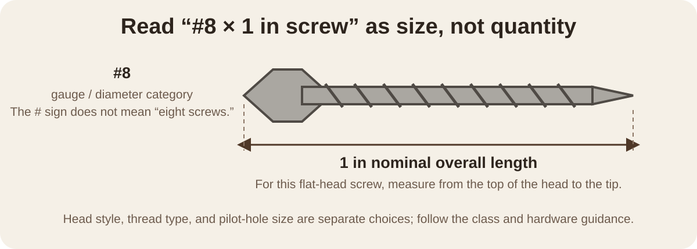

### Pilot hole

A hole drilled before driving a screw. It guides the screw and reduces splitting. Its diameter and depth depend on the screw, wood, and whether the hole passes through the first part or receives threads; use the instructor's or screw maker's recommendation rather than guessing from the screw's outside diameter.

### Countersink

A conical recess at the top of a hole that lets a flat-head screw sit flush with or slightly below the surface. **Countersunk** describes a hole with this recess.

### Elongated or slotted hole

A hole lengthened in one direction so a screw can move sideways as solid wood expands and contracts. On this table the holes in the upper drawer guides are elongated **across the tabletop's grain**, while the screw heads still hold the top down.

### Brad

A thin finishing nail with a small head. The rabbeted-drawer article uses brads to reinforce glued corner joints. Gauge and length must suit the parts and avoid emerging through a face.

## Shape and layout terms

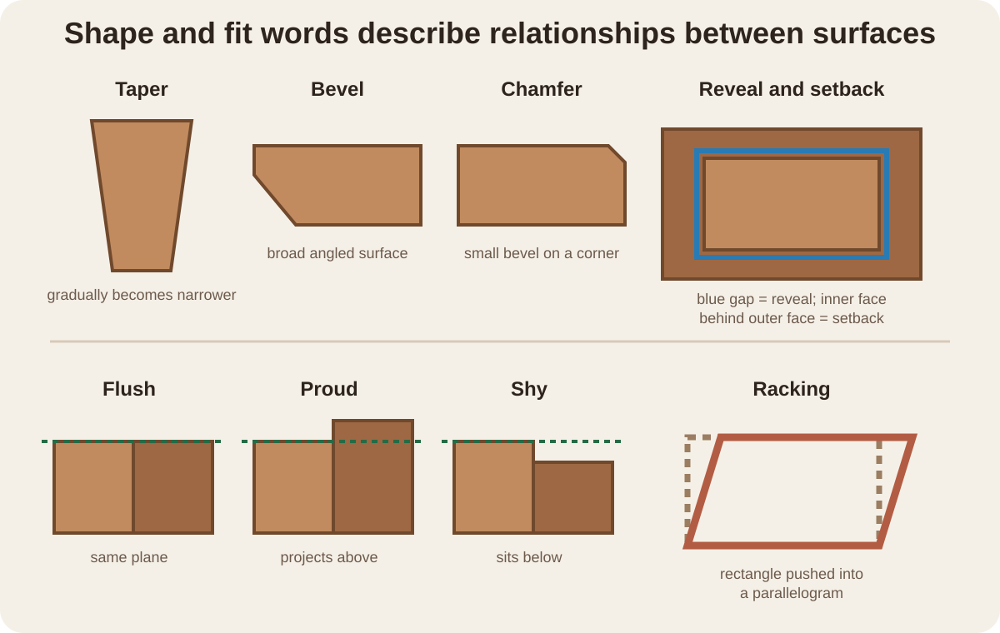

### Taper

A gradual reduction in width or thickness. Each leg begins **1 1/8 in thick x 1 1/8 in wide**. The taper begins **1 in below the bottom of the rails/aprons**, affects only the two inside faces, and ends at a foot **5/8 in thick x 5/8 in wide**. The two outside faces remain straight.

### Bevel

An angled surface that does not meet the adjoining face at 90 degrees. The tabletop's underside bevel begins **2 in inward from the edge** and removes **1/4 in vertically** at the outside of a **3/4-in-thick** top. That leaves an outer edge **1/2 in thick**. The article's table-saw method uses an angle near **7°**. The `2 in` measures bevel width across the underside; the `1/4 in` measures the vertical amount removed, not the thickness left behind.

### Chamfer

A relatively narrow bevel used to remove a sharp corner. A chamfer needs a size, such as `1/8 x 1/8 in`, to be repeatable. The article only says to break the sharp edges lightly, so it does not give a fixed chamfer dimension.

### Reveal

A deliberate visible gap or offset. The even gap around the drawer front is its reveal. Measure it perpendicular to each edge between the drawer front and the surrounding rails or legs. The article does not prescribe a final reveal; fit it to the actual assembled opening.

### Setback

The perpendicular distance one part sits behind another face. The outer face of each apron is **3/16 in behind** the adjacent outside face of the leg.

### Flush

Two adjoining surfaces are in the same plane with no step between them. Their offset is effectively zero.

### Proud

A surface or part projects above an adjacent reference surface. Say how much if it matters, such as `1/32 in proud`.

### Shy

A surface or part sits below an adjacent reference surface. Say how much if it matters, such as `1/32 in shy`.

### Racking

Sideways distortion that pushes a rectangular frame toward a parallelogram. Aprons, rails, sound joints, and a square glue-up help a table resist racking.

## Grain and board orientation

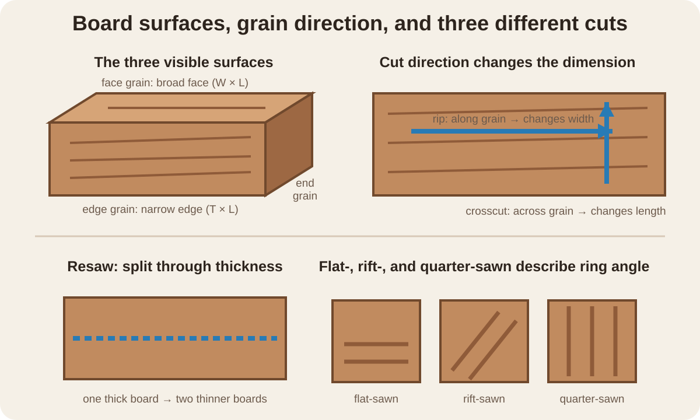

### Grain

The direction and visible pattern of the wood fibers.

### Figure

The visible decorative pattern created by grain direction, growth, and the way a board was sawn. Figure is an appearance term, not a dimension or a guarantee of strength.

### Face grain

The grain visible on a board's broad **width x length** surface.

### Edge grain

The grain visible on a board's narrow **thickness x length** surface.

### End grain

The exposed ends of the fibers on the **thickness x width** cross-section at either end of a board. Growth-ring orientation is easiest to see here.

### Growth rings

The annual layers visible on the end grain. Their orientation influences the figure on the board's faces and how the board moves as humidity changes.

### Flat-sawn

Boards cut so growth rings are generally closer to parallel with the broad face—roughly 0° to 30° in common usage. They often show cathedral-shaped face grain. Dealer definitions can vary.

### Quarter-sawn

Boards cut so growth rings are generally closer to perpendicular to the broad face—roughly 60° to 90° in common usage. They often show straighter grain and characteristic ray figure in some species. Dealer definitions can vary.

### Rift-sawn

Boards cut so growth rings meet the face at an angle between typical flat-sawn and quarter-sawn orientations—roughly 30° to 60° in common usage. Rift-sawn faces often show straight, even grain and are prized for legs. Dealer definitions can vary.

### Bastard grain

The source article uses this traditional term for a leg blank whose growth rings run approximately corner to corner, producing similar-looking grain on all four faces. A lumber dealer may instead describe this as rift-like or diagonally oriented grain.

### Grain matching

Arranging parts so their color and grain work together visually. The best boards in this project are reserved for the tabletop and drawer front.

### With the grain and against the grain

Cutting **with the grain** follows the fiber direction and usually leaves a cleaner surface. Cutting **against the grain** lifts fibers and can cause tear-out. Grain direction should be checked before jointing, planing, routing, or hand-planing.

## Milling and cutting operations

### Mill or milling

The process of turning rough lumber into flat, straight, square parts of controlled thickness, width, and length.

### Joint or jointing

Flattening a face or straightening an edge. A **jointer** makes one face flat or one edge straight; it does not by itself guarantee that the opposite face is parallel.

### Plane or thickness-planing

Using a thickness planer to make the opposite face parallel to the reference face and bring the board to final thickness. A planer does not reliably flatten a twisted board unless one face has already been made flat or supported by a sled.

### Rip cut

A cut made generally along the grain. It usually changes **width** while leaving thickness unchanged. Example: ripping an 8-in-wide board to 5 1/4 in rough width.

### Crosscut

A cut made generally across the grain. It changes **length** while leaving thickness and width unchanged. Example: crosscutting a board to a 13-in rough length before later trimming it to 12 1/2 in finished length.

### Resaw

Cutting through a board's thickness, parallel to its broad face, to create two thinner boards. It changes **thickness**. A 1-in-thick board does not yield two finished 1/2-in boards because the saw kerf and later flattening consume material. Resawing may be useful for drawer stock, but the pieces must still be flattened and planed after the cut.

### Flatten

Remove cup, bow, twist, or uneven areas so one face lies in a plane.

### Square an end

Trim the end so it is 90 degrees to the reference edge and face.

### Final dimension

The exact target thickness, width, or length after milling. Do not take a part to final dimension until the required reference surfaces and the sequence of dependent operations are understood.

### Snipe

A shallow step or depression that a planer can leave near the beginning or end of a board. Leave enough end allowance to remove it, or prevent it using the instructor-approved machine setup; do not assume a fixed snipe length.

### Tear-out

Fibers torn below the intended surface instead of being cut cleanly, often because a blade meets difficult or reversing grain. Tear-out consumes milling allowance and can make a nominally adequate board too thin for the finished part.

## Defects and movement

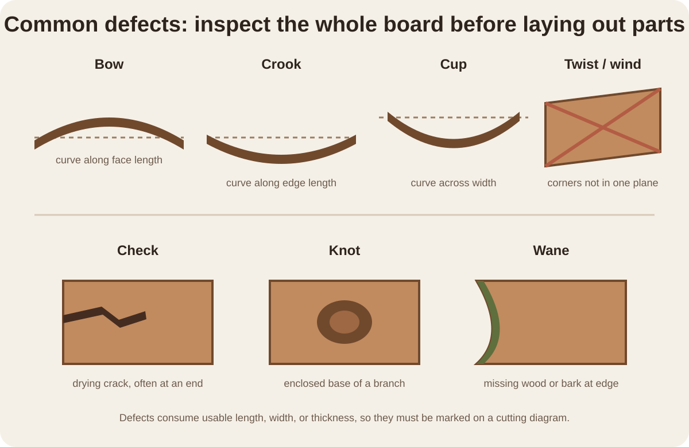

### Bow

A curve along the **length of a board's face**. Viewed from the side, the board rises away from a straight reference line.

### Crook

A curve along the **length of a board's edge**. Viewed from above, a long edge bends sideways.

### Cup

A curve **across the width** of a board. Viewed from the end, the broad face looks hollow or crowned.

### Twist or wind

A condition in which the board's four face corners do not lie in the same plane. Winding sticks help make twist visible.

### Check

A crack caused by drying, often starting at an end and running along the grain. Measure past the full crack before counting usable length; the visible tip may not show its full extent.

### Knot

The base of a branch enclosed in the board. Knots can affect appearance, strength, and machining.

### Wane

Missing wood or remaining bark along an edge or corner of a board. Wane reduces usable width and sometimes thickness.

### Wood movement

Wood changes width and thickness as its moisture content changes. Length changes very little by comparison. The tabletop attachment holes are elongated so the solid top can move across its grain without splitting or stressing the base.

## Lumberyard questions for this project

When preparing to buy the lumber, ask:

1. Is the cherry and poplar rough, S2S, S3S, or S4S?
2. What is the actual measured thickness after any surfacing?
3. Is the lumber kiln-dried, and is it ready for indoor furniture?
4. Are boards sold by the board foot, linear foot, or piece?
5. How does the dealer calculate and round board-foot tally?
6. Are widths and lengths random, and may customers select individual boards?
7. Is 8/4 cherry available for the legs, with enough clear material to orient the grain?
8. Is 4/4 cherry available for parts that finish at 3/4 in?
9. Are short boards or offcuts available for the small parts and test pieces?
10. How much acclimation time does the instructor recommend before milling?

## Translation of this project's common notations

| Plan notation | Plain-language meaning |
|---|---|
| `8/4 cherry` | Cherry in the nominal 2-in rough-thickness category; no width or length is stated, and the actual thickness must be measured |
| `1 1/8 in square` | The part is 1 1/8 in thick x 1 1/8 in wide; no length is stated |
| `3/4 x 5 x 12 1/2 in` | Finished 3/4 in thickness x 5 in width x 12 1/2 in overall length |
| `3/8-in-thick x 3/8-in-long tenons` | Each apron tongue is 3/8 in thick and projects 3/8 in from its shoulder; its width comes from the mortise and shoulder layout |
| `3/8-in tenon both ends` in the cut list | There is a tenon at each end of the apron; the drawing clarifies that each is 3/8 in thick x 3/8 in long |
| `3/16-in setback` | The apron face sits 3/16 in behind the outside face of the leg; this is a face-to-face offset, not a part size |
| `taper to 5/8 in` | Reduce only the two inside leg faces gradually so the foot finishes 5/8 in thick x 5/8 in wide |
| `1/4 x 2 in bevel` | Remove 1/4 in vertically over 2 in of underside width; on the 3/4-in top this leaves a 1/2-in-thick outer edge |
| `1/4 x 1/2 in rabbet` in the cut list | The drawer article clarifies the orientation: 1/2 in wide inward from the end x 1/4 in deep into the face |
| `in a 1/4 x 1/4 in groove` | The drawer-bottom edge fits a channel 1/4 in wide across the opening x 1/4 in deep into the part |
| `3/16 x 3/16 in notch` | Remove a square corner 3/16 in wide x 3/16 in deep from each drawer guide |
| `Ø 7/8 in` or `7/8-in-diameter knob` | The knob is approximately 7/8 in across through its center |
| `7° bevel` | The source's table-saw method tilts the blade about seven degrees away from vertical; confirm the setup with the instructor and test pieces |
| `#120 grit` | Abrasive particle grade; the number is not a dimension or quantity |
| `#8 x 1 in screw` | Number 8 gauge x 1 in nominal length; `#8` does not mean a quantity of eight |

## What this means for the cutting diagram

A reliable cutting diagram cannot be based only on `12 board feet`. It must also state:

- The actual number, width, length, and thickness of the boards available
- Which boards have defects or unusable ends
- Grain and color priorities for the top, drawer front, aprons, and legs
- Rough-milling allowances
- Saw kerf and jointing loss
- Whether thinner drawer parts will be bought at thickness or resawn
- Extra stock for machine setup and test cuts

The [cutting diagram and lumber plan](CUTTING_DIAGRAM.md) separates **what to buy**, **rough blanks to prepare**, and **finished parts in the article cut list**. It includes a clearly labeled example layout and a worksheet for recording the actual boards. Keeping those three stages separate prevents nominal lumber names from being mistaken for final dimensions.
