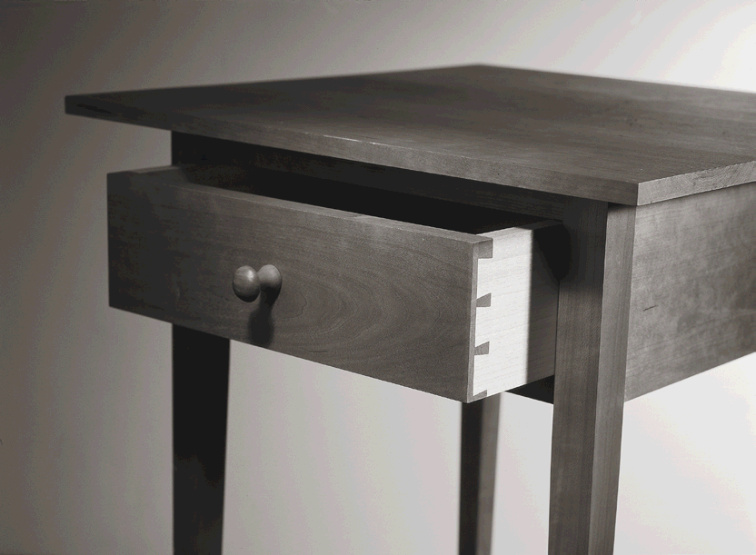
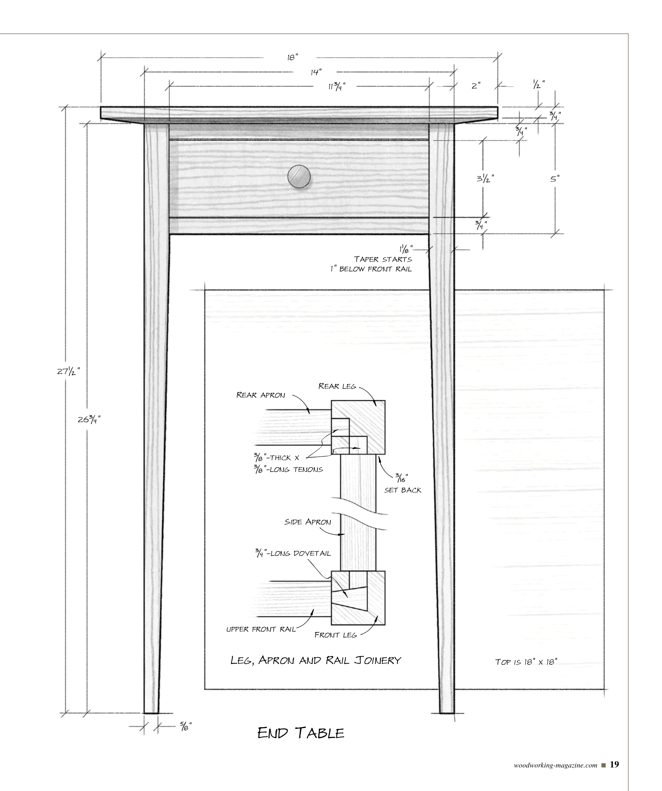
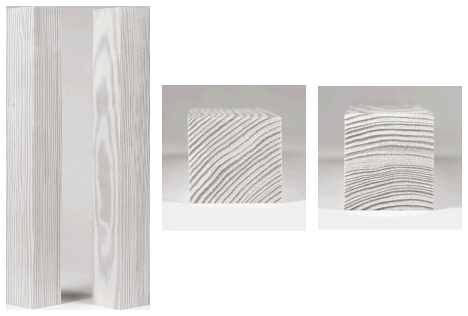
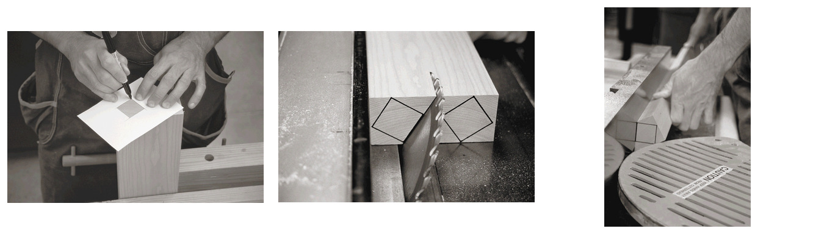
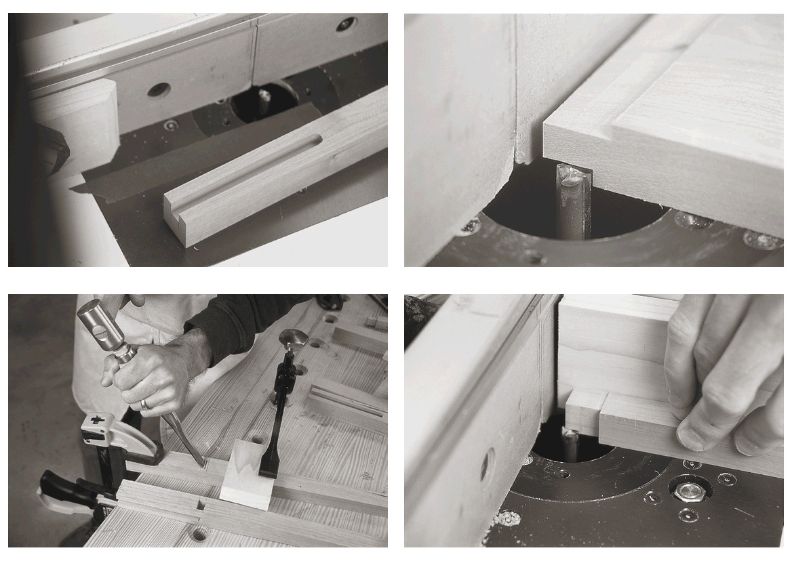
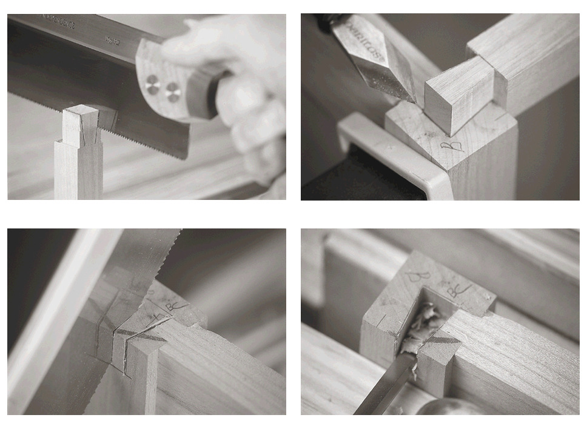
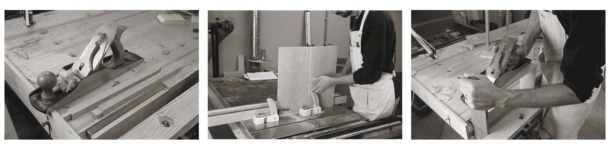
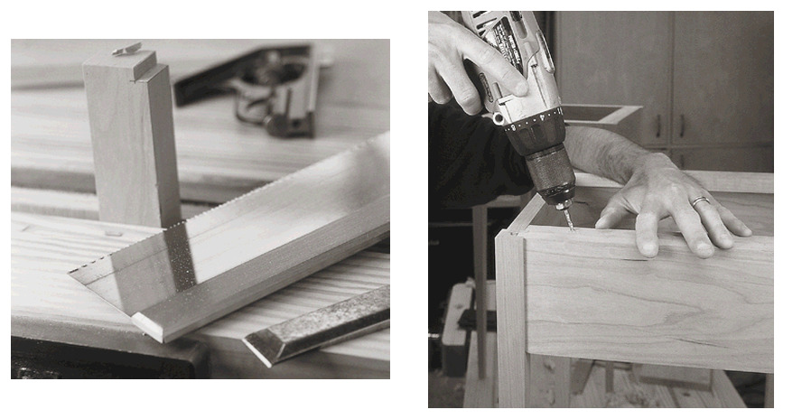

# Shaker end table - project base

This is the working reference for the woodworking class project. It summarizes the design and build order from Christopher Schwarz's "Simple Shaker End Table," published in *Woodworking Magazine*, Autumn 2004, magazine pages 16-21.

- [Original article PDF](https://www.popularwoodworking.com/app/uploads/2010/10/HiRes-SEPT2004-Seg2.pdf)
- Local-only archival copy: `source/popular-woodworking-shaker-end-table.pdf` (excluded from the public repository)
- [Beginner's lumber and woodworking terminology](LUMBER_AND_WOODWORKING_TERMINOLOGY.md)
- Main article in the local PDF: pages 1-6
- Companion sections: panel glue-up on PDF pages 7-8, rabbeted drawers on pages 9-12, and brushing lacquer on pages 15-16

The text below is a workshop summary, not a transcription. Verify critical dimensions against the dimensioned drawing and class instructions before cutting.

## Design baseline

The table has a light Shaker profile: a square top with a wide underside bevel, slender tapered legs, narrow reveals, and one drawer. The article estimates about 12 board feet of wood, but the actual purchase should allow for leg-grain selection, top matching, defects, and test pieces.

| Item | Article baseline |
|---|---:|
| Top | 18 x 18 x 3/4 in |
| Overall height | Approximately 27 1/2 in |
| Base footprint | Approximately 14 x 14 in |
| Leg at top | 1 1/8 in square |
| Leg at foot | 5/8 in square |
| Apron setback from leg faces | 3/16 in |
| Main apron mortise and tenon | 3/8 in deep/long |
| Primary wood | Cherry |
| Drawer secondary wood | Poplar |

The drawing above is the exact source illustration. Open [page 4 of the original PDF](https://www.popularwoodworking.com/app/uploads/2010/10/HiRes-SEPT2004-Seg2.pdf#page=4) for its surrounding notes and full-size context.

## Article cut list

Dimensions are **thickness x width x length**. These are finished sizes from the article, not rough-stock sizes.

### Table

| Qty. | Part | Finished size (in) | Material | Article note |
|---:|---|---|---|---|
| 4 | Legs | 1 1/8 x 1 1/8 x 26 3/4 | Cherry | Taper the two inside faces to a 5/8-in-square foot |
| 1 | Top | 3/4 x 18 x 18 | Cherry | 1/4 x 2 in bevel on the underside |
| 3 | Aprons | 3/4 x 5 x 12 1/2 | Cherry | 3/8-in tenon at both ends |
| 2 | Front rails | 3/4 x 3/4 x 13 1/4 | Cherry | Lower rail uses tenons; upper rail uses dovetails |
| 4 | Drawer guides | 3/4 x 1 x 12 1/8 | Cherry | Notched around the legs |
| 2 | Spacers | 3/16 x 3/4 x 11 3/4 | Cherry | Glued to the aprons |

### Drawer

| Qty. | Part | Finished size (in) | Material | Article note |
|---:|---|---|---|---|
| 1 | Front | 3/4 x 3 1/2 x 11 3/4 | Cherry | 1/4 x 1/2 in rabbet at the ends for the simple drawer option |
| 2 | Sides | 1/2 x 3 1/2 x 12 1/4 | Poplar | Fit to the assembled opening |
| 1 | Back | 1/2 x 3 x 11 3/4 | Poplar | 1/4 x 1/2 in rabbet at the ends |
| 1 | Bottom | 1/2 x 11 1/4 x 12 3/8 | Poplar | Fits a 1/4 x 1/4 in groove |

The article's drawer dimensions assume the rabbeted construction described later in the PDF. If the class requires hand-cut dovetails, establish the joinery and bottom detail before treating these dimensions as final.

## Build sequence

### 1. Select and mill stock

Reserve the best appearance boards for the top and drawer front, then the aprons. The article emphasizes straight leg grain with growth rings running approximately corner to corner on the end grain. This produces similar-looking figure on all four faces.

The source begins with rough 8/4 stock for the legs, uses an oversized 1 3/8-in-square template to find the best orientation, then rips and mills each blank to 1 1/8 in square.

**Checkpoint:** Label every leg and its two outside faces. Mill all related parts together, then verify straightness, square, and final thickness before laying out joinery.

### 2. Glue up the top

Arrange boards for a visually continuous surface, especially at the seams. Joint the mating edges, glue the panel, and let it cure before bringing it to final 18 x 18 in size. The companion article on local PDF pages 7-8 gives the source's panel-glue-up method.

**Checkpoint:** Keep the top over thickness and oversize until the panel is flat and stable enough for final surfacing.

### 3. Cut apron mortises and tenons

The article centers 3/8-in-wide mortises on the top ends of the legs and leaves them open at the top. The front legs receive an apron mortise on one face; the rear legs receive them on two faces. Matching apron tenons are 3/8 in long. The source uses a router table and a 3/8-in straight bit for both operations.

Use test stock milled to the same thickness as the real parts. Fit should be snug by hand without forcing the fragile short grain at the open mortise.

### 4. Join the front rails

The lower front rail uses a 3/8-in-thick x 5/8-in-wide x 3/4-in-long tenon into a 3/4-in-deep mortise in each front leg. Its mortise wall begins 1/4 in behind the front edge of the leg.

The upper front rail uses an approximately 3/4-in-long hand-cut dovetail at each end. The article suggests an angle around 8 degrees and relies on the rail's shoulders to hide small fitting corrections. Dry-assemble the base, transfer each tail directly to its leg, and cut the sockets from those marks.

**Checkpoint:** Keep each joint paired and labeled. Do not interchange left/right rails or legs after fitting.

### 5. Taper the legs

The taper begins 1 in below the bottom edge of the front rail/aprons and ends at a 5/8-in-square foot. Taper only the two inside faces of each leg. The article bandsaws or jigsaws near the line, then cleans the surface with a hand plane or jointer.

**Checkpoint:** Lay out all four legs as a set and compare the marks before cutting. Preserve the labeled outside faces.

### 6. Prepare surfaces, dry-fit, and glue the base

Plane or sand the base parts before assembly; the article recommends sanding from #100 through #180 or #220. Dry-fit the full base, check both diagonals, inspect for twist, and verify rail and apron reveals. Glue the two side assemblies first, recheck the upper-rail dovetails, then complete the base glue-up.

### 7. Install drawer guides and top attachment points

Notch all four guides 3/16 x 3/16 in around the legs. Glue the lower guides flush with the lower front rail so the drawer has a continuous running surface. Drill and elongate countersunk holes in the upper guides before gluing them flush with, or slightly below, the apron tops. Those holes attach the top while allowing seasonal movement.

### 8. Shape and attach the top

Bring the panel to 18 x 18 x 3/4 in. The article's underside bevel is 2 in wide and leaves a 1/4-in edge. Its table-saw method uses an approximately 7-degree blade setting; a rasp, file, scraper, and sanding block are the hand-tool alternative. Attach the top through the elongated holes with #8 x 1 in screws.

**Checkpoint:** Center the base under the top, verify an even overhang, and do not overtighten the screws.

### 9. Build and fit the drawer

Choose the drawer method with the instructor before cutting joinery. The original table shown in the article has a hand-dovetailed drawer; PDF pages 9-12 document the simpler rabbeted option used by the cut list. Build the drawer after the top is attached, then plane the drawer to a smooth running fit and establish an even reveal around the front. Add a removable stop at the back if desired.

### 10. Finish

Break sharp edges lightly with #120-grit paper. The article uses boiled linseed oil to deepen cherry color, followed by a satin lacquer film finish. The local PDF's lacquer companion appears on pages 15-16. Confirm the class finish schedule, cure times, ventilation, and oily-rag handling rules before beginning.

## Current decisions

Update this table whenever the class or project owner settles a choice.

| Decision | Current position | Status | Last updated |
|---|---|---|---|
| Visible wood | Cherry, following the article | Baseline; confirm availability | 2026-09-20 |
| Drawer secondary wood | Poplar | Baseline; confirm availability | 2026-09-20 |
| Drawer joinery | Hand dovetails or simple rabbets | Open - ask instructor | 2026-09-20 |
| Base joinery | Article's simplified mortise-and-tenon plus upper-rail dovetails | Baseline; confirm class method | 2026-09-20 |
| Top bevel method | Table saw or hand-shaped | Open - choose with instructor | 2026-09-20 |
| Finish | Boiled linseed oil plus satin lacquer | Baseline; confirm class finish rules | 2026-09-20 |
| Knob | Cherry Shaker-style knob, approximately 7/8 in, 3/8-in tenon | Baseline | 2026-09-20 |

## Measurement record

Record actual values here once parts are milled and the base is dry-fitted. Later parts, especially the drawer, should be fitted to these measurements.

| Measurement | Article target | Actual | Date/notes |
|---|---:|---:|---|
| Leg blank size | 1 1/8 x 1 1/8 x 26 3/4 in |  |  |
| Front base width | Approximately 14 in |  |  |
| Side base depth | Approximately 14 in |  |  |
| Base diagonals | Equal |  |  |
| Drawer opening width | Fit from assembly |  |  |
| Drawer opening height | Fit from assembly |  |  |
| Top size | 18 x 18 x 3/4 in |  |  |
| Finished height | Approximately 27 1/2 in |  |  |

## Source page map

The local PDF page number is different from the printed magazine page number.

| Local PDF pages | Printed pages | Topic |
|---:|---:|---|
| 1-6 | 16-21 | Main Shaker end table article, cut list, and drawing |
| 7-8 | 22-23 | Gluing up flat panels |
| 9-12 | 24-27 | Simple and fast rabbeted drawers |
| 13-14 | 28-29 | Sliding-lid box drawer primer |
| 15-16 | 30-31 | Brushing lacquer |
| 17-18 | 32 and extras | Unrelated article and magazine material |

Full-resolution renders of the six main article pages are stored in the local working copy at `images/pages/` and are excluded from the public repository. All published images in this project base were extracted from the source PDF and remain credited to the original publication and photographers.
