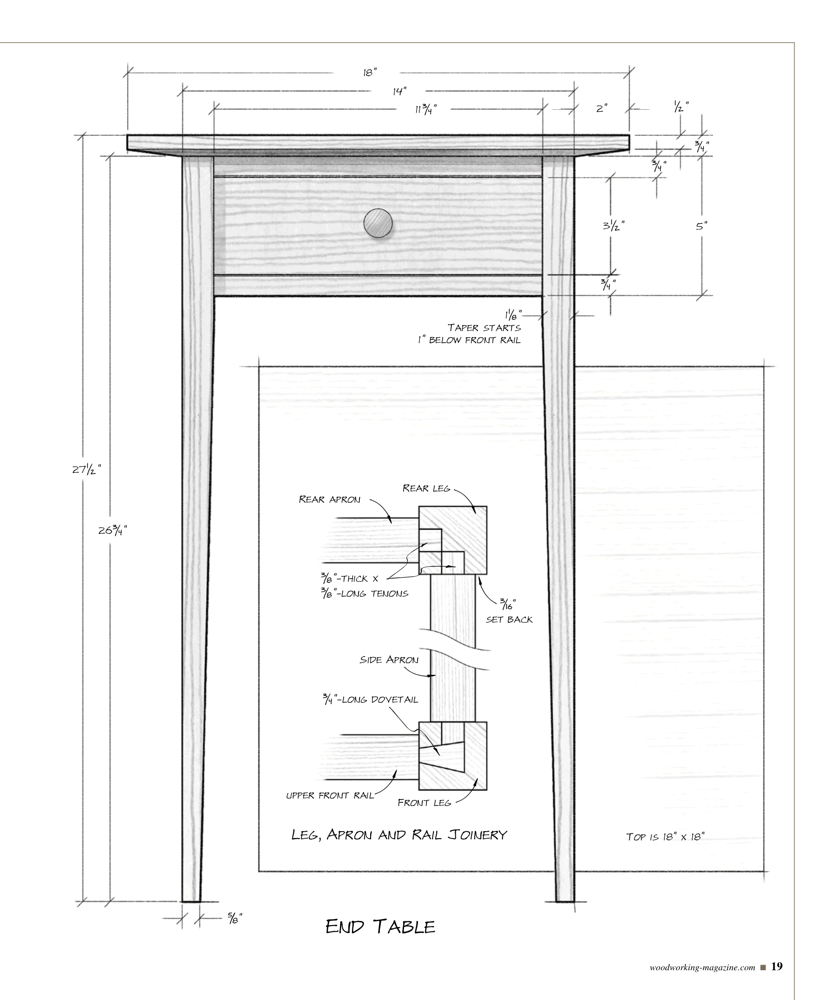
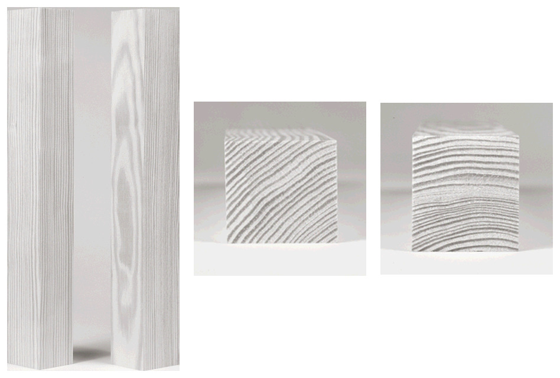
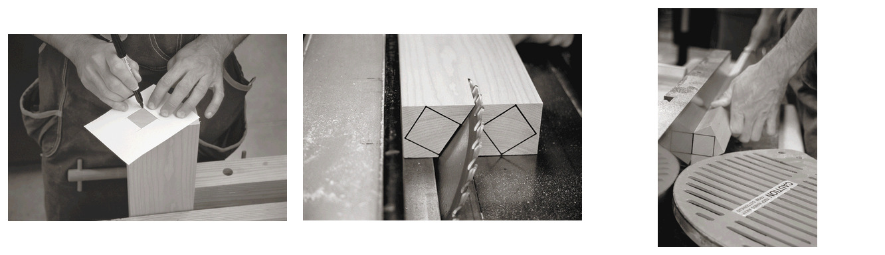
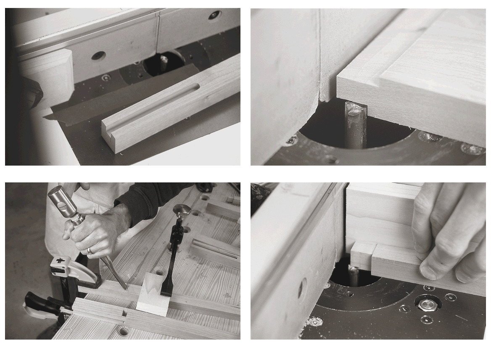
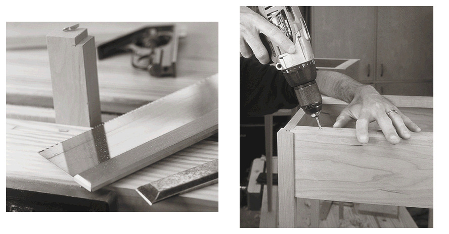
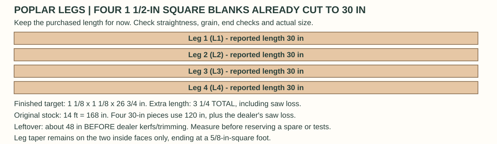

# Shaker end table - project base

This is the working reference for the woodworking class project. It summarizes the design and build order from Christopher Schwarz's "Simple Shaker End Table," published in *Woodworking Magazine*, Autumn 2004, magazine pages 16-21.

- [Original article PDF](https://www.popularwoodworking.com/app/uploads/2010/10/HiRes-SEPT2004-Seg2.pdf)
- Local-only archival copy: `source/popular-woodworking-shaker-end-table.pdf` (excluded from the public repository)
- [Beginner's lumber and woodworking terminology](LUMBER_AND_WOODWORKING_TERMINOLOGY.md)
- [Cutting diagram and lumber plan](CUTTING_DIAGRAM.md)
- Main article in the local PDF: pages 1-6
- Companion sections: panel glue-up on PDF pages 7-8, rabbeted drawers on pages 9-12, and brushing lacquer on pages 15-16

**Current build, 2026-10-08:** poplar throughout, purchased square-stock legs, and **no drawer**. The proposed drawer-free base uses four matching aprons and two top-attachment cleats; confirm its front mortise layout with the instructor. The [current cutting plan](CUTTING_DIAGRAM.md) fits these parts to the reported purchase and includes jointing and planing. Source photos and the original cut list below show the earlier cherry table with a drawer.

The text below is a workshop summary, not a transcription. Verify critical dimensions against the dimensioned drawing and class instructions before cutting.

**Instructor reading added 2026-10-08:** [Carl's Wisdom](CARLS_WISDOM.md) organizes Carl Spagnoli's 2026-09-23 class email and annotated Woodsmith comparison plan. His notes encourage four aprons without a drawer and purchased square leg stock for beginners. They support those simplifications; the exact front-corner mortise layout remains for instructor review. See [Tapering the Legs](CARLS_WISDOM_TAPERING.md) for source diagrams and his explicit restriction against beginners independently using the Woodsmith jointer-tapering method.

## Original article design baseline

The original table has a light Shaker profile: a square top with a wide underside bevel, slender tapered legs, narrow reveals, and one drawer. The article estimates about 12 board feet of wood, but the actual purchase should allow for leg-grain selection, top matching, defects, and test pieces.

| Item | Article baseline |
|---|---:|
| Top | 18 x 18 x 3/4 in |
| Overall height | Approximately 27 1/2 in |
| Base footprint | Approximately 14 x 14 in |
| Leg at top | 1 1/8 in square |
| Leg at foot | 5/8 in square |
| Apron setback from leg faces | 3/16 in |
| Main apron mortise and tenon | 3/8 in deep/long |
| Primary wood | Cherry |
| Drawer secondary wood | Poplar |

The drawing above is the exact source illustration. Open [page 4 of the original PDF](https://www.popularwoodworking.com/app/uploads/2010/10/HiRes-SEPT2004-Seg2.pdf#page=4) for its surrounding notes and full-size context.

## Article cut list

Dimensions are **thickness x width x length**. These are archival finished sizes from the article. **For our current build, use four aprons, two upper guides as top cleats, and no rails, spacers or drawer parts; all wood is poplar.** The current rough and finished cut list is in the [purchased-stock plan](CUTTING_DIAGRAM.md#rough-blanks-and-finished-parts).

### Table

| Qty. | Part | Finished size (in) | Material | Article note |
|---:|---|---|---|---|
| 4 | Legs | 1 1/8 x 1 1/8 x 26 3/4 | Cherry | Taper the two inside faces to a 5/8-in-square foot |
| 1 | Top | 3/4 x 18 x 18 | Cherry | 1/4 x 2 in bevel on the underside |
| 3 | Aprons | 3/4 x 5 x 12 1/2 | Cherry | 3/8-in tenon at both ends |
| 2 | Front rails | 3/4 x 3/4 x 13 1/4 | Cherry | Lower rail uses tenons; upper rail uses dovetails |
| 4 | Drawer guides | 3/4 x 1 x 12 1/8 | Cherry | Notched around the legs |
| 2 | Spacers | 3/16 x 3/4 x 11 3/4 | Cherry | Glued to the aprons |

### Drawer

| Qty. | Part | Finished size (in) | Material | Article note |
|---:|---|---|---|---|
| 1 | Front | 3/4 x 3 1/2 x 11 3/4 | Cherry | 1/4 x 1/2 in rabbet at the ends for the simple drawer option |
| 2 | Sides | 1/2 x 3 1/2 x 12 1/4 | Poplar | Fit to the assembled opening |
| 1 | Back | 1/2 x 3 x 11 3/4 | Poplar | 1/4 x 1/2 in rabbet at the ends |
| 1 | Bottom | 1/2 x 11 1/4 x 12 3/8 | Poplar | Fits a 1/4 x 1/4 in groove |

The drawer rows above describe the article's rabbeted option. The hand-cut dovetail choice recorded on 2026-09-24 was superseded on 2026-10-08 when the owner omitted the drawer. None of these drawer parts is required for the current build.

## Current build sequence

### 1. Select and mill stock

Reserve the best appearance sections of the purchased poplar for the top, then the four aprons. Keep the two top cleats within the apron parent stock until face and thickness milling is complete. The article emphasizes straight leg grain with growth rings running approximately corner to corner on the end grain. This produces similar-looking figure on all four faces.

Our four purchased poplar leg blanks are reported as 1 1/2 in square x 30 in long. Keep the full length during initial preparation; joint and plane to 1 1/8 in square, then trim to 26 3/4 in. The source photo below shows its alternative extraction from wider 8/4 stock. Its 1 3/8-in template is an oversized grain-selection aid, not our final leg size.

The class shop has jointing and planing machines. Establish a flat reference face and a straight edge, then plane the opposite face parallel. Keep short/narrow parts in shop-safe parent stock while milling. Verify that the measured flat boards can finish at 3/4 in, with allowance for top-panel cleanup. See the [milling sequence](CUTTING_DIAGRAM.md#jointing-and-planing-at-the-shop).

**Checkpoint:** Label every leg and its two outside faces. Mill all related parts together, then verify straightness, square, and final thickness before laying out joinery.

### 2. Glue up the top

Arrange boards for a visually continuous surface, especially at the seams. Joint the mating edges, glue the panel, and let it cure before bringing it to final 18 x 18 in size. The companion article on local PDF pages 7-8 gives the source's panel-glue-up method.

**Checkpoint:** Keep the top over thickness and oversize until the panel is flat and stable enough for final surfacing.

### 3. Cut apron mortises and tenons

The article centers 3/8-in-wide mortises on the top ends of the legs and leaves them open at the top. For our proposed four-apron base, **all four legs receive apron mortises on two adjacent inside faces**. This repeats the source rear-corner arrangement at the front. Matching apron tenons are 3/8 in long. The source uses a router table and a 3/8-in straight bit for both operations.

Use test stock milled to the same thickness as the real parts. Fit should be snug by hand without forcing the fragile short grain at the open mortise.

### 4. Fit the new front apron

The new front apron matches the side and rear aprons: 3/4 x 5 x 12 1/2 in, including two 3/8-in-long tenons. Its shoulder-to-shoulder length is 11 3/4 in. The front legs require the matching apron mortises instead of the original rail joints. Confirm the adjacent mortise layout, tenon fit and 3/16-in setback with the instructor.

**Checkpoint:** Dry-assemble all four aprons and legs, keeping joints paired and labeled. The original upper-rail dovetails and lower-rail tenons are omitted. Their earlier illustrations remain in the terminology reference and [archived cutting examples](CUTTING_DIAGRAM_2026-09-24.md).

### 5. Taper the legs

The taper begins 1 in below the bottom edge of the aprons and ends at a 5/8-in-square foot. Taper only the two inside faces of each leg. The article bandsaws or jigsaws near the line, then cleans the surface with a hand plane or jointer.

The [dedicated taper reference](CARLS_WISDOM_TAPERING.md) separates hand-plane refinement from Woodsmith's four-face table-saw jig and advanced jointer method. Carl's annotated attachment marks jointer tapering as unsuitable for beginners; choose and demonstrate the method in class before cutting our legs.

**Checkpoint:** Lay out all four legs as a set and compare the marks before cutting. Preserve the labeled outside faces.

### 6. Prepare surfaces, dry-fit, and glue the base

Plane or sand the base parts before assembly; the article recommends sanding from #100 through #180 or #220. Dry-fit the full base, check both diagonals, inspect for twist, and verify apron setbacks. Glue the two side assemblies first, then join them with the front and rear aprons using the instructor-approved sequence. Recheck square and twist before the glue sets.

### 7. Install the two top cleats

Retain only the source's two upper guides, now called top cleats, each 3/4 x 1 x 12 1/8 in. Fit their ends and 3/16 x 3/16-in corner notches to the assembled base. Drill and elongate countersunk holes across the tabletop grain before attaching the cleats inside the side aprons, flush with or slightly below their tops. Confirm the positions with the instructor. These holes let the solid top move seasonally.

The source photo includes drawer construction; our lower guides and spacers are omitted.

### 8. Shape and attach the top

Bring the panel to 18 x 18 x 3/4 in. The article's underside bevel is 2 in wide and removes 1/4 in vertically, leaving a 1/2-in-thick outer edge. Its table-saw method uses an approximately 7-degree blade setting; a rasp, file, scraper, and sanding block are the hand-tool alternative. Attach the top through the elongated holes with #8 x 1 in screws.

**Checkpoint:** Center the base under the top, verify an even overhang, and do not overtighten the screws.

### 9. Finish the poplar

Break sharp edges lightly with #120-grit paper. Test the intended finish on a poplar offcut from this purchase. The article uses boiled linseed oil and satin lacquer on cherry; that is historical context, not an adopted finish for our poplar table. Confirm the class finish schedule, cure times, ventilation and rag-handling rules before beginning.

## Current decisions

Update this table whenever the class or project owner settles a choice.

| Decision | Current position | Status | Last updated |
|---|---|---|---|
| Instructor notes and taper-method boundary | Carl's 2026-09-23 email supports a four-apron/no-drawer beginner build and square leg stock; its Woodsmith attachment marks jointer tapering as unsuitable for beginners | Reading indexed on the website; exact front mortises, adapted jig if used, and taper method still require instructor direction. No finished dimension or finish changed | 2026-10-08 |
| Wood throughout | Poplar for the entire table, including the legs | Confirmed by project owner; replaces cherry and the primary/secondary wood split | 2026-10-08 |
| Drawer | Omitted to simplify the build | Owner decision; supersedes the 2026-09-24 hand-cut dovetail choice and all drawer stock reservations | 2026-10-08 |
| Base joinery | Four matching aprons with the source rear-corner mortise-and-tenon joint; new front apron 3/4 x 5 x 12 1/2 in | Proposed adaptation for instructor review; affects both front legs' mortises and removes the two rails and their joints | 2026-10-08 |
| Internal supports | Two 3/4 x 1 x 12 1/8-in upper guides retained as top cleats | Confirm fit, notches and slotted top-screw holes; lower guides and spacers omitted | 2026-10-08 |
| Finished dimensions | Top 3/4 x 18 x 18 in; legs 1 1/8 square x 26 3/4 in; base about 14 x 14 in; height about 27 1/2 in | Article targets retained; verify milling yield and assembled fit | 2026-10-08 |
| Top bevel method | Table saw or hand-shaped | Open - choose with instructor | 2026-09-20 |
| Finish | Test on purchased poplar before selecting the class schedule | Open; article's cherry oil/lacquer treatment is no longer the assumed finish | 2026-10-08 |
| Knob | Not required | Drawer omitted | 2026-10-08 |
| Flat-stock purchase | One poplar 10-ft board, recalled as 1x8, dealer-cut into two approximately 60-in boards | Purchased; actual thickness, width, usable length and defects unmeasured | 2026-10-08 |
| Leg-stock purchase | One reported 1 1/2 x 1 1/2 x 168-in poplar stick; dealer-cut into four 30-in blanks plus a remainder | Purchased; keep 30-in lengths during preparation; remainder is 48 in before saw loss, not a measured value | 2026-10-08 |
| Rough allowances and layout | Top strips 6 3/4 x 19; four aprons 5 1/2 x 13; two cleats 1 1/4 x 13 (rough width x length, in) | Revised for the shorter purchased boards; finished targets unchanged. Board 2 needs at least 59 1/2 in and clear usable width 6 7/8 in with stated kerfs/end reserves | 2026-10-08 |
| Jointing and planing | Class machines available; joint reference surfaces and plane to size, retaining safe parent lengths and widths | Owner confirmed machine access; instructor controls sequence, workholding, machine minimums and allowances | 2026-10-08 |
| Printed cutting handout | Current square-stock PDF replaced with a three-page purchased-poplar/no-drawer plan; whole-table cutaway, both board layouts, legs, top glue-up/base diagram and blank actual-measurement cells included | Local print material only; excluded from website. Older terms and hypothetical cutting PDFs remain earlier references | 2026-10-08 |

## Purchased stock reported on 2026-10-08

The owner confirmed **poplar throughout** and **no drawer**. The flat stock is recalled as nominal 1x8, dealer-cut from one 10-ft board into two approximately 60-in pieces. Actual thickness, width and usable length still need measuring. The [current layout](CUTTING_DIAGRAM.md) allocates the top, four aprons and two top cleats to those two boards. Earlier hypothetical cherry/drawer layouts are archived and do not apply to this purchase.

The square stock was reported as 1 1/2 x 1 1/2 x 168 in before dealer cutting. The four resulting leg blanks were reported as 30 in long. Keep them at that length during inspection and early preparation. The finished article target is 1 1/8 x 1 1/8 x 26 3/4 in, leaving 3 1/4 in of total length for final trimming and saw loss. Do not apply the old layout's two 1-in end reserves around a 29-in rough blank; that would require more than 30 in.

The square-stock remainder is 48 in **before** dealer kerfs and any end trimming; its usable length is unmeasured. Likewise, two halves of a nominal 120-in board may each be slightly under 60 in because the dealer cut removes wood. Measure every actual piece and mark defects before assigning parts.

## Measurement record

Record actual values here once parts are milled and the base is dry-fitted. Fit the top cleats and attachment details to the assembled base; use measured stock and joint fit to confirm every dependent dimension.

| Measurement | Article target | Actual | Date/notes |
|---|---:|---:|---|
| Leg blank size | 1 1/8 x 1 1/8 x 26 3/4 in |  |  |
| Front base width | Approximately 14 in |  |  |
| Side base depth | Approximately 14 in |  |  |
| Base diagonals | Equal |  |  |
| Apron thickness and shoulder span | 3/4 thick; 11 3/4 between shoulders |  |  |
| Top-cleat fit and screw penetration | Fit from assembly |  |  |
| Top size | 18 x 18 x 3/4 in |  |  |
| Finished height | Approximately 27 1/2 in |  |  |

## Source page map

The local PDF page number is different from the printed magazine page number.

| Local PDF pages | Printed pages | Topic |
|---:|---:|---|
| 1-6 | 16-21 | Main Shaker end table article, cut list, and drawing |
| 7-8 | 22-23 | Gluing up flat panels |
| 9-12 | 24-27 | Simple and fast rabbeted drawers |
| 13-14 | 28-29 | Sliding-lid box drawer primer |
| 15-16 | 30-31 | Brushing lacquer |
| 17-18 | 32 and extras | Unrelated article and magazine material |

Full-resolution renders of the six main article pages are stored in the local working copy at `images/pages/` and are excluded from the public repository. Source photographs and drawings remain credited to the original publication and photographers. The purchased-leg SVG is a project-created planning diagram.
