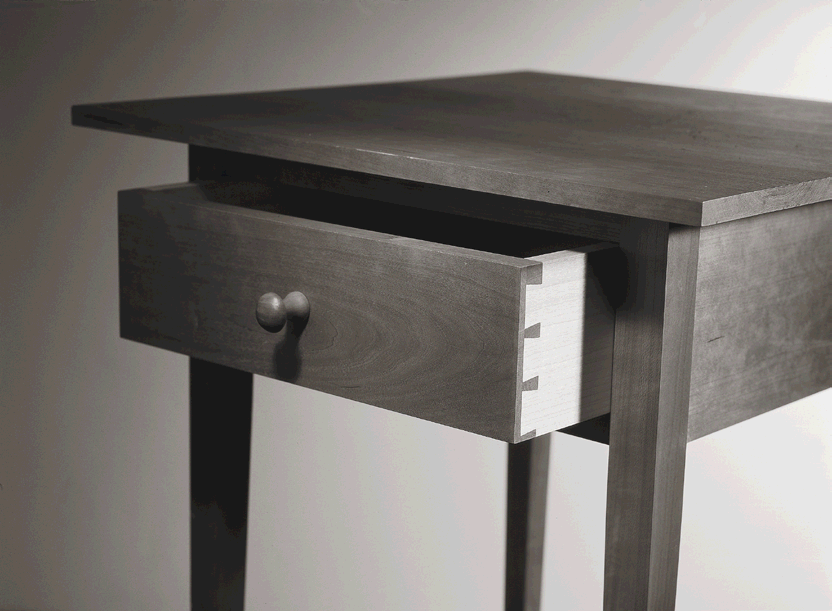
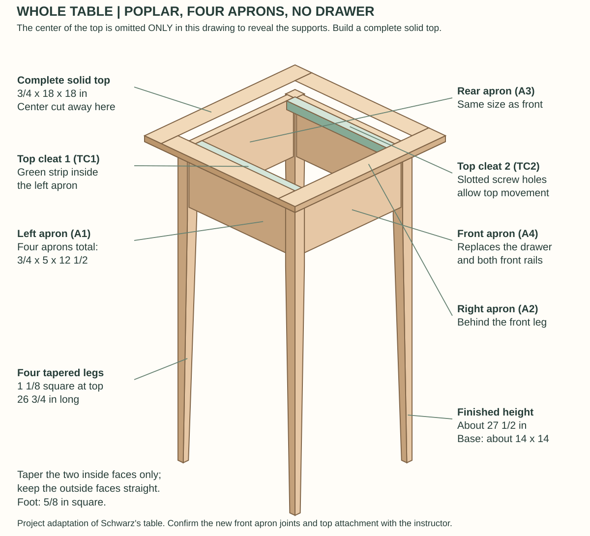

An illustrated, beginner-friendly reference for building Christopher Schwarz's *Simple Shaker End Table* in a woodworking class.

**Current build (8 October 2026): all poplar, square-stock legs, no drawer.** The revised plan uses a fourth matching front apron and two top cleats.

## Project references

### [Illustrated project guide](PROJECT_BASE.md)

The archival article cut list and drawing, current drawer-free build sequence, joinery photographs, decision log and actual-measurement record.

### [Lumber and woodworking terminology](LUMBER_AND_WOODWORKING_TERMINOLOGY.md)

A plain-language guide to nominal lumber sizes, hardwood quarter sizes, board feet, table anatomy, joinery, grain, milling, defects, and lumberyard language.

### [Cutting diagram and lumber plan](CUTTING_DIAGRAM.md)

Complete layouts for the two purchased poplar boards and four 30-in square leg blanks, revised aprons and top cleats, jointing/planing allowances, and a blank measurement worksheet.

### [Original Popular Woodworking PDF](https://www.popularwoodworking.com/app/uploads/2010/10/HiRes-SEPT2004-Seg2.pdf)

The complete source article by Christopher Schwarz, followed by companion material on panel glue-ups, rabbeted drawers, and brushing lacquer.

## Project at a glance

| Item | Current build |
|---|---:|
| Top | 18 x 18 x 3/4 in |
| Overall height | 27 1/2 in |
| Base footprint | 14 x 14 in |
| Wood throughout | Poplar |
| Drawer | Omitted |
| Main base joint | Mortise-and-tenon |
| Front | Proposed matching apron with mortise-and-tenon joints |

The original drawer-version drawing remains in the [project guide](PROJECT_BASE.md).

## Attribution and shop use

This educational reference is based on Christopher Schwarz's "Simple Shaker End Table," published in *Woodworking Magazine*, Autumn 2004, pages 16-21. Selected illustrations remain the property of their respective copyright holders. See [the complete attribution](ATTRIBUTION.md).

Class shop rules and instructor guidance take priority over this reference.
